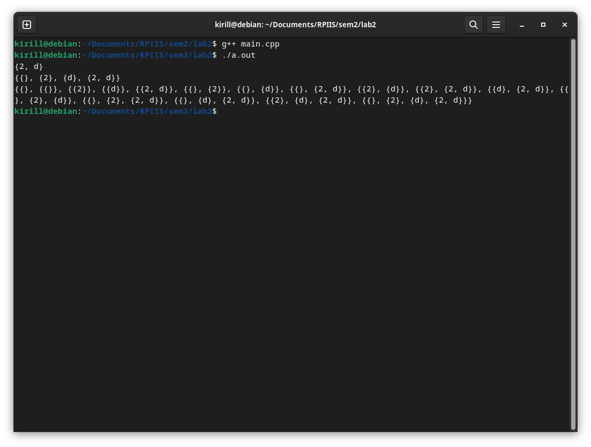

# лабораторная работа №2 (вариант 5)

## условие

**Постановка задачи:** Реализовать программу, формирующую множество равное булеану исходного множества.

## список определений

`Множество` - это совокупность определенных и различных между собой объектов. 

Объекты, из которых состоит множество, называют `элементами множества`.

`Булеан` - множество, состоящее из всех подмножеств данного множества A (включая пустое множество и само множество A).

## реализация

Поскольку в первой лабораторной работе была написана библиотека для работы со множествами функция для нахождения булеана множества будет писаться на основе этой библиотеки.

Заголовочный файл библиотеки называется [mySet.h](myset.h). Встроенный файл реализации называется [mySet.inl](myset.inl). Для использования данной библиотеки требуется подключить заголовочный файл [mySet.h](myset.h).


```c++
template<typename T>
mySet<mySet<T>> boolean(const mySet<T> set) {
    mySet<mySet<T>> result;
    mySet<T> tmp;

    for (int i = 0; i < pow(2, set.getSize()); i += 1) {
        int t1 = i;
        for (int j = 0; j < set.getSize(); j += 1) {
            int t2 = t1 % 2;
            t1 = t1 / 2;
            if (t2) {
                tmp.add(set[j]);
            }
        }

        result.add(tmp);
        tmp.clear();
    }
    return result;
}
```

Функция для нахождения булеана множества (множества всех нестрогих подмножеств). На вход функции подается множество для которого требуется найти булеан, на выход - булеан данного множества (если тип подаваемого множества mySet\<int\>, то на выход пойдет mySet\<mySet\<int\>\>). 

### моменты которые стоит отметить

Для нахождения множества всех подмножеств будем использовать следующий алгоритм:
- Создается пустой контейнер `result` для хранения всех подмножеств.

- Создается пустой контейнер `tmp` для формирования каждого подмножества.

- Определяется размер исходного множества и обозначается как `n`.

- Внешний цикл выполняется `pow(2, n)` раз, чтобы обеспечить перебор всех возможных комбинаций элементов.

- Внутри внешнего цикла инициализируется переменная `t1` со значением текущей итерации внешнего цикла.

- Внутренний цикл выполняется `n` раз и используется для создания каждого подмножества. Переменная `j` представляет собой индекс элемента в исходном множестве или массиве.

- На каждой итерации внутреннего цикла, значение переменной `t2` устанавливается равным остатку от деления `t1` на 2. Затем значение переменной `t1` делится на 2.

- Если значение `t2` равно 1, то элемент с соответствующим индексом `j` добавляется во временное подмножество `tmp`.

- По завершении внутреннего цикла, временное подмножество `tmp`, содержащее элементы текущей комбинации, добавляется в контейнер `result`.

- После добавления временного подмножества `tmp` в `result`, временное подмножество `tmp` очищается, чтобы быть готовым для следующей комбинации.

- По завершении внешнего цикла, контейнер `result` содержит все подмножества исходного множества или массива.

- Контейнер `result` возвращается как результат выполнения функции.

Общая идея алгоритма заключается в использовании двоичного представления чисел от 0 до `pow(2, n) - 1` для определения комбинаций элементов из исходного множества или массива. Каждый бит числа соответствует наличию или отсутствию элемента в подмножестве.
<br>

## тесты

В файле [main.cpp](main.cpp) импортируется библиотека для нахождения булеана множества и тестируются ее работоспособность

```c++
#include <iostream>
#include "myset.h"

int main() {
    mySet<char> a, b, c;

//    a.add('a'); a.add('b'); a.add('c');  
    a.add('d'); a.add('2');
    printSet(a);

    auto d = boolean(a);
    printSet(d);
    printSet(boolean(d));

    return 0;
}
```



## Вывод

- Были повторены основы теории множеств
- На основе библиотеки разработанноя в первой лабораторной работе, была разработана функция находящая булеан множества
