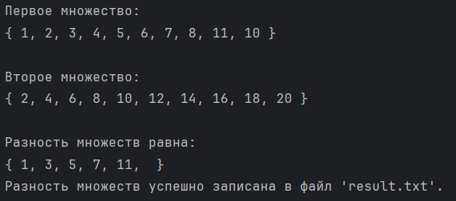
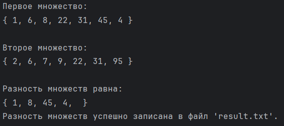

# Лабораторная работа №2
---

## Задача	
			
### Вариант 13

 Реализовать программу, формирующую множество равное разности двух исходных множеств (с учётом кратных вхождений элементов).

---

## Цель:

 Исследовать свойства структур данных и разработать библиотеку алгоритмов обработки структур данных (для нахождения пересечения множеств, считанных из файла).

---

## Список ключевых понятий:

 **Множество** — простейшая информационная конструкция и математическая структура,
позволяющая рассматривать какие-то объекты как целое, связывая их.

 **Разность множеств** - это множество, состоящее из тех и только тех элементов, которые входят в первое множество, но не входят во второе.

---

## **Список используемых алгоритмов в данном коде:**

1. **Чтение из файла (read_set_from_file):**
   - Считывает строки из файла и удаляет лишние пробелы
   - Создает множество в виде словаря, где ключи - элементы, а значения - их кратность

2. **Вывод множеств на экран (read_and_print_file):**
   - Считывает все содержимое файла
   - Выводит содержимое файла на экран

3. **Запись множеств в файл (write_set_to_file):**
   - Открывает файл и записывает в него множество.

4. **Разбиение всех множеств на элементы (calculate_difference):**
   - Считает разность между двумя множествами.

---
## Код

```

def read_set_from_file(filename):
    try:
        with open(filename, 'r') as file:
            # Считываем строки из файла и удаляем лишние пробелы
            lines = [line.strip() for line in file.readlines()]
            # Создаем множество в виде словаря, где ключи - элементы, а значения - их кратность
            data_set = {}
            for line in lines:
                if line in data_set:
                    data_set[line] += 1
                else:
                    data_set[line] = 1
            return data_set
    except FileNotFoundError:
        print(f"Файл '{filename}' не найден.")
        return {}

def read_and_print_file(filename):
    """
    Функция считывает все содержимое файла и выводит его на экран, заменяя абзацы на ", ".
    Входные данные: filename - имя файла.
    """
    try:
        with open(filename, 'r') as file:
            # Считываем все содержимое файла
            content = file.read()
            # Заменяем абзацы на ", "
            content = content.replace('\n', ', ')
            # Выводим содержимое файла на экран
            print("{",content,"}")
    except FileNotFoundError:
        print(f"Файл '{filename}' не найден.")


def write_set_to_file(filename, data_set):
    with open(filename, 'w') as file:
        for item, count in data_set.items():
            for _ in range(count):
                file.write(str(item) + '\n')


def calculate_difference(set1, set2):
    difference = dict(set1)
    for item, count in set2.items():
        if item in difference:
            difference[item] -= count
            if difference[item] <= 0:
                del difference[item]
        else:
            difference[item] = -count
    return difference


filename_set1 = 'set1.txt'
filename_set2 = 'set2.txt'
filename_result = 'result.txt'
print(f"Первое множество: ")
read_and_print_file(filename_set1)
print(f"")
print(f"Второе множество: ")
read_and_print_file(filename_set2)
print(f"")
set1 = read_set_from_file(filename_set1)
set2 = read_set_from_file(filename_set2)

result_set = calculate_difference(set1, set2)

write_set_to_file(filename_result, result_set)

print(f"Разность множеств равна: ")
read_and_print_file(filename_result)
print(f"Разность множеств успешно записана в файл '{filename_result}'.")
```
# Тесты

Тест №1
---


Тест №2
---


---

## Вывод

В ходе выполнения был реализован алгоритм нахождения разности произвольных множеств
