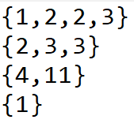
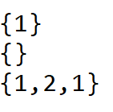
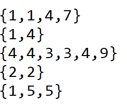

# Лабораторная работа №2 по ПиОИвИС
# Цель работы:
Изучить теорию множеств и закрепить полученные знания с помощью написания программы, решающей определенную теоретико-множественную задачу.
# Задание(вариант 10):
Реализовать программу, формирующую множество равное объединению произвольного количества исходных множеств (с учётом кратных вхождений элементов).
# Список используемых понятий:
**Множество** - простейшая информационная конструкция и математическая структура, позволяющая рассматривать какие-то объекты как целое, связывая их. Объекты, связываемые некоторым множеством, называются элементами этого множества.  
**Множеством с кратными вхождениями элементов** называют множество **S** тогда и только тогда, когда существует **x** такой, что истинно **S|x|** > 1.  
**Объединением** множеств **A** и **B** с учётом кратных вхождений элементов будем называть неориентированное множество **S** тогда и только тогда, когда для любого **x** истинно **S|x| = max{A|x|, B|x|}**.
# Алгоритм решения задачи:
1. Открывается файл, в котором хранятся исходные множества(одна строка - одно множество; элементы множеств - целые числа; элементы множеств разделены между собой запятыми).
2. i = 1.
3. Пока не считаны все строки файла:  
    3.1. Считывается i-ая строка файла(i-ое множество);  
    3.2. Элементы i-ого множества заносятся в вектор set;  
    3.3. Вектор set добавляется в двумерный вектор sets, хранящий все исходные множества;  
    3.4. Вектор set обнуляется;  
    3.5. i = i + 1.  
4. j = 1.
5. Пока не пройдены все множества двумерного вектора sets:  
    5.1. Берется j-ое множество двумерного вектора sets;  
    5.2. Для каждого элемента j-ого множества считается количество вхождений данного элемента в данное множество;  
    5.3. Полученные пары(1-ая компонента - элемент множества, 2-ая компонента - количество вхождений элемента в множество) заносятся в вектор пар entry;  
    5.4. Вектор пар entry добавляется в двумерный вектор пар pairs, хранящий полученные векторы пар;  
    5.5. Вектор пар entry обнуляется;  
    5.6. j = j + 1.  
6. a = 1.
7. b = 1.
8. Выполняется операция объединения исходных множеств(с учетом кратных вхождений):  
    8.1. Для каждого элемента исходных множеств(1-ой компоненты пар векторов двумерного вектора пар pairs) находится максимальная кратность вхождения в множество(2-ая компонента пар векторов двумерного вектора пар pairs) через сравнение всех 2-х компонент пар, 1-ые компоненты которых равны(т.е. из всех пар(векторов двумерного вектора пар pairs) с одинаковой 1-ой компонентой выбирается пара с наибольшей 2-ой компонентой);  
    8.2. Полученные пары(1-ая компонента - элемент множества, 2-ая компонента - максимальная кратность вхождения элемента в какое-либо множество) заносятся в вектор пар union_pairs;  
    8.3. k = 1;  
    8.4. Берется k-ая пара вектора пар union_pairs;  
    8.5. В вектор union заносятся m элементов, равных n(n - 1-ая компонента k-ой пары, m - 2-ая компонента k-ой пары);  
    8.6. k = k + 1;
    8.7. Если k <= q(q - количество пар в векторе пар union_pairs), переход к пункту 8.4, иначе к пункту 9.  
9. Вектор union - объединение исходных множеств с учетом кратных элементов.
# Тестовые примеры:
1) **Вход:**  
  
**Выход:**  
  
2) **Вход:**  
  
**Выход:**  
  
3) **Вход:**  
  
**Выход:**  

4) **Вход:**  
  
**Выход:**  
  
5) **Вход:**  
  
**Выход:**  
  
# Вывод:
В результате работы была изучена теория множеств, а также реализована программа на языке С++, находящая множество, равное объединению произвольного количества исходных множеств(с учетом кратных вхождений элементов).
