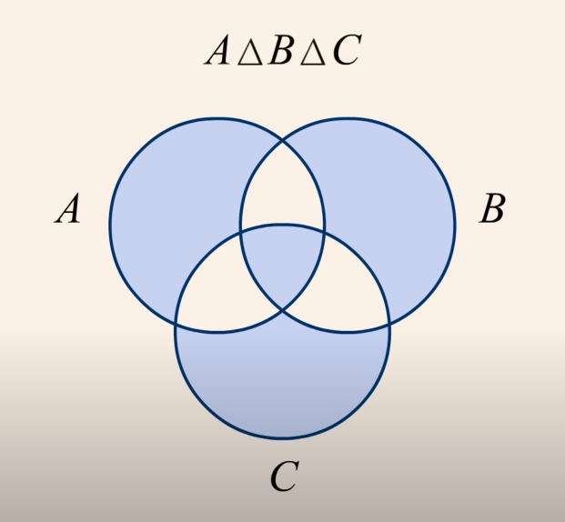
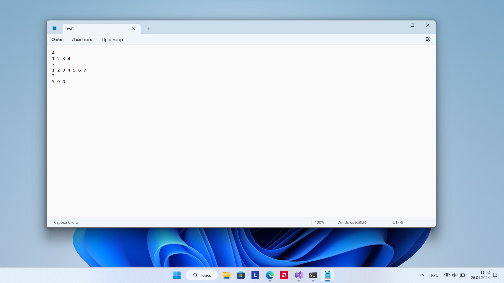
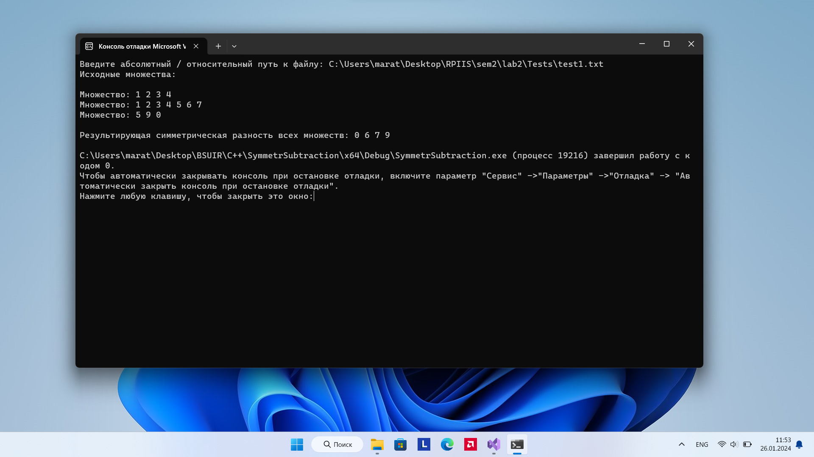

# Лабораторная работа №2
## Лабораторная работа 🔢


<em>Схематичное представление симметрической разности</em>

- `Цель` - нахождение $\textcolor{#e28679}{\textit{симметрической разности}}$ произвольного количества множеств 
- `Задача` - реализовать алгоритм симметрической разности
- `Вариант` - $\textcolor{grey}{\textit{3}}$

## Список ключевых понятий (определения) ❓
- `Вычитание` - это множество, в котором содержатся элементы множества А, которых нету во множестве В (Записывается как А / В)

- `Симметрическая разность` - это множество, полученное взаимным вычитанием множеств друг из друга (А / В + В / А)
## Алгоритм
Пусть у нас есть задача: найти симметрическую разность неопределённого количества множеств. В таком ключе задача кажется нетривиальной, ведь мы не знаем, какое количество множеств нам передадут в программу и что вообще делать с таким количеством. Пользуясь стратегией `разделяй и властвуй`, можно задачу разбить на частные случаи и найти закономерность, по которой задачу можно решить для большего количества множеств. В нашем случае частными случаями будут передача в программу одного и два множества❗❗❗Что в них такого особенного? В случае, когда на вход программе подаётся одно множество означает, что оно и будет результатом, т.к. нету второго множества, с которым надо провести операцию симметрической разности. В случае с двумя множествами мы находим их результирующее множество. Что дальше? Соединив воедино два частных случая мы имеем:
- В результате операции симметрическая разность мы получаем новое множество
- Когда количество множеств = 1, то результатом является само множество
Хорошенько подумав, можно прийти к такому решению:
Будем хранить все наши множества в массиве, ведь так удобнее обращаться к каждому множеству + может храниться произвольное количество множеств, что как раз нам и необходимо. В самой функции создадим множество, которое будет результатом симметрической разности всех множеств, и будет содержать 0 элементов (такое множество называется `пустым`). Что дальше? Теперь стоит вспомнить, что результатом симметрической разности есть множество, поэтому с ним так же можно привести операцию симметрической разности. Получается, что симметрическая разность 3 множеств - это симметрическая разность первых двух, а затем их результирующего множество и 3-его. В случае для 4-х множеств - всё, что для симметрической разности 3-х множеств + симметрическая разность результирующего множества этих 3-х множеств и 4-го. Вот и весь алгоритм. С самого начала результирующее множество пустое для того, чтобы для первого множества симметрическая разность была самим множеством, ведь у него нету соседа, с которым можно было бы произвести симметрическую разность.

## Реализация алгоритма

### Разность множеств
Для того, чтобы реализовать разность одного множества А на В. Для этого довольно просто пробежаться по множеству А, где каждый его элемент мы сначала сравним со всеми элементами множества В, прежде чем перейдём к следующему элементу множества А. Если совпадение найдётся, то отбрасываем данный элемент

``` C++
static set<int> subtract(Set a, Set b) {
	set<int> result;

	bool flag = true;

	for (auto i : a.getArr()) {
		for (auto j: b.getArr()) {
			if (i == j++) {
				flag = false;
				break;
			}
		}

		if (flag) {
			result.insert(i);
		}

		i++;
		flag = true;
	}

	return result;
}
```

### Симметрическая разность

Т.к. симметрическая разность - это объединение двух разностей (А / B + B / A). То достаточно вызвать метод разности, поменяв переменные местами

``` c++
static set<int> symmetrSubtract(Set setA, Set setB) {
	set<int> resultAB = subtract(setA, setB);
	set<int> resultBA = subtract(setB, setA);
	resultAB.insert(resultBA.begin(), resultBA.end());

	return resultAB;
};
```

### Симметрическая разность всех множеств
(См. алгоритм решения) На вход методу подаётся массив множеств, остаётся только произвести симметрическую разность двух рядом стоящих множеств, а его в свою очередь присвоить результирующему множеству затем произвести симметрическую разность этого результирующего множества и следующего множества. Результат мы сохраняем в результирующее множество для того, чтобы не потерять результат симметрической разности предыдущих множеств.

``` c++
static set<int> symmetrSubtractAll(vector<Set> sets) {
	set<int> result = {};
	Set temp(result);

	for (int i = 0; i < sets.size(); i++) {
		set<int> tempResult = symmetrSubtract(sets[i], result);
		result = tempResult;
	}

	return result;
};
```
## Пример запуска
Структура файла с произвольным количеством множеств: сначала в первой строке хранится размер, затем на следующей строке содержится само множество, и так последовательно друг за другом для всех множеств. Программа считывает посимвольно, поэтому гарантируется, что множества будут считываться корректно (указывая целочисленные данные)



При запуске программы, первым делом программа просит нас написать абсолютный/относительный путь к файлу. Давайте введём тестовый пример


Затем программа показывает все множества, что участвуют в симметрической разности. А в конце выводит их результирующее множество


## Вывод
Реализовал алгоритм `симметрической разности`
## Источники
В ходе лабораторной работы никакие источники не были использованы