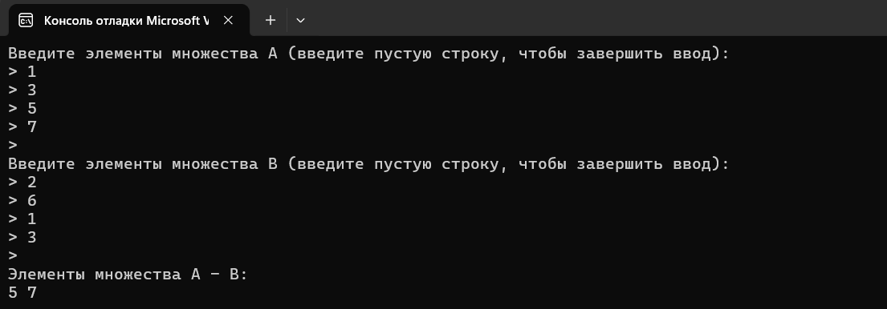

# 
Лабораторная работа №2

Вариант 4. Реализовать программу, формирующую разницу двух множеств.

## 
Цели и задачи лабораторной работы : 

1.Разработать эффективную программу, которая вычисляет разницу между двумя множествами.
2.Обеспечить корректность и точность результатов вычислений.
3.Сделать программу гибкой и удобной в использовании для различных наборов данных.
4.Реализовать функцию, которая принимает два множества в качестве входных данных и возвращает разницу этих множеств.
5.Обеспечить эффективную обработку множеств различных размеров и типов данных(числа, строки, объекты и т.д.).
6.Реализовать проверку на корректность входных данных и обработку некорректных входных данных. 

## 
Список используемых понятий и алгоритмов : 

1.Множество - упорядоченная коллекция уникальных элементов.
2.Элемент множества - объект, входящий в состав множества.
3.Разница множеств - это множество, содержащее элементы, принадлежащие первому множеству, но не принадлежащие второму множеству.
4.Уникальность - свойство множества, при котором в нем не может быть двух одинаковых элементов.
5.Перебор элементов - простой алгоритм, при котором каждый элемент первого множества проверяется на принадлежность второму множеству.Элементы, не найденные во втором множестве, добавляются в результирующее множество.
6.Хеш - таблица - алгоритм, в котором второе множество сохраняется в хеш - таблице, а затем каждый элемент первого множества проверяется на наличие в хеш - таблице.Элементы, не найденные в хеш - таблице, добавляются в результирующее множество.

## 
Описание используемых алгоритмов : 

**Список используемых алгоритмов в данном коде : **

1. * *Перебор элементов : **
В функции inputSet() происходит последовательный ввод элементов множества от пользователя.Каждый введенный элемент проверяется на корректность(является ли он числом) и добавляется в множество.
В функции difference() для вычисления разности двух множеств используется перебор элементов первого множества.Для каждого элемента первого множества проверяется, присутствует ли он во втором множестве.Если элемент не найден, он добавляется в результирующее множество.

2. * *Хеш - таблица : **
В функции difference() для эффективного поиска элементов во втором множестве используется хеш - таблица.Второе множество set2 сохраняется в неупорядоченном множестве(unordered_set), которое реализовано на основе хеш - таблицы.Это позволяет быстро проверять, присутствует ли элемент первого множества во втором множестве.

3. * *Вывод элементов множества : **
В функции printSet() происходит последовательный вывод всех элементов заданного множества.

## 
Результаты тестирования : 

Тестирование проводилось вручную.

## 
Вывод:

В ходе лабораторной работы были улучшены навыки обработки множеств и вычисления их разницы в C++.Освоены принципы структур данных, таких как стеки, для обработки вложенных множеств.

Реализовано вычисление разницы. Активно использовались стандартные контейнеры C++ для эффективной работы с данными.

Плоучен новый опыт работы с обработкой данных, предоставил новые знания.Применение модульного тестирования подчеркнуло надежность и корректность реализации, предоставляя полезные инсайты в использование стандартных инструментов C++.

## 
Используемые источники : 

1. https ://www.cplusplus.com/reference/set/set/
	2. https ://en.cppreference.com/w/cpp/container/set
	3. https ://en.cppreference.com/w/cpp/container/unordered_set
	4. https ://www.geeksforgeeks.org/set-difference-in-c-set-stl/
	5. https ://stackoverflow.com/questions/11187593/how-to-find-the-difference-between-two-sets-in-c
	6. https ://www.amazon.com/Programming-Principles-Practice-Using-2nd/dp/0321992784
	7. собственные знания 