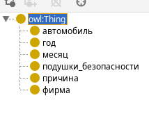
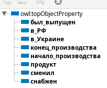
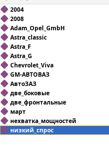
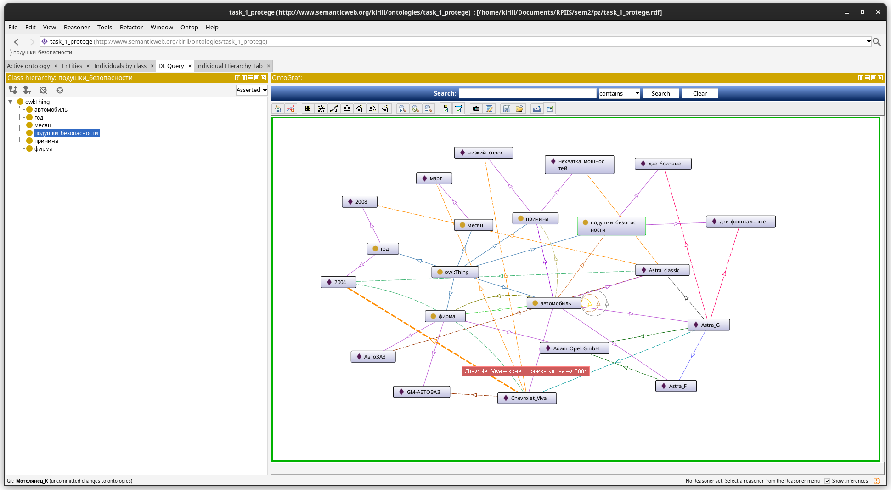
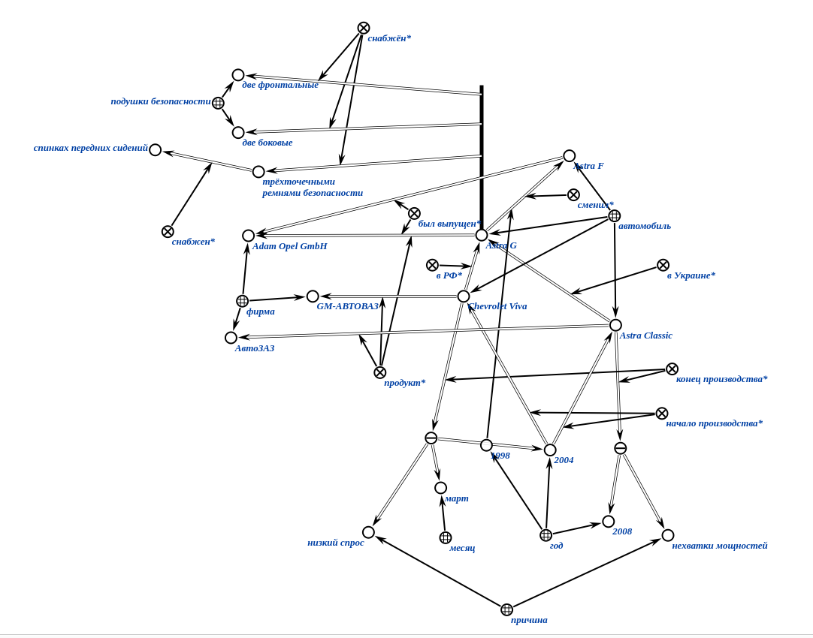
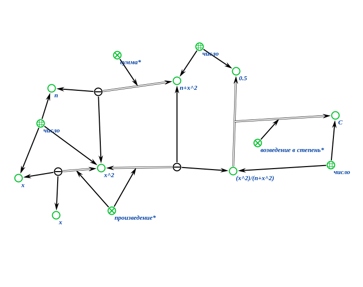

# Самостоятельная работа

## задание

1. Opel Astra G — компактный автомобиль фирмы Adam Opel GmbH сменивший Astra F в 1998 году. В Российской Федерации фирма GM-АВТОВАЗ начала производство Opel Astra G в версии седан в 2004 году под названием Chevrolet Viva. В марте 2004 года производство было прекращено из-за низкого спроса. В Украине автомобиль собирали на заводе АвтоЗАЗ с 2004 по конец 2008 года под названием Opel Astra Classic. Производство было остановлено из-за нехватки мощностей на конвейере под другие модели. Автомобиль снабжён трёхточечными ремнями безопасности, четырьмя подушками безопасности (две фронтальные и две боковые, спрятанные в спинках передних сидений).
2. $$ C = \fraq{x^2}{n+x^2} ^ 0.5 $$
## задание 1 protege

**классы**

**отношения**

**сущности**

**онтограф**

## задание 1 KBE

## задание 2 KBE

