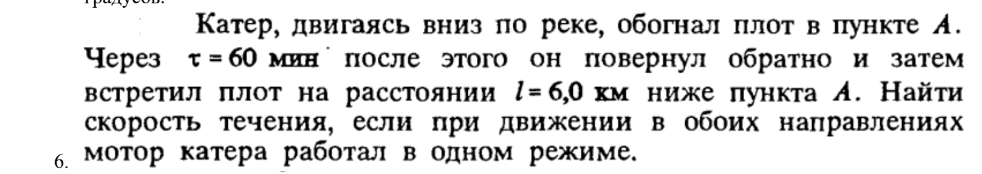
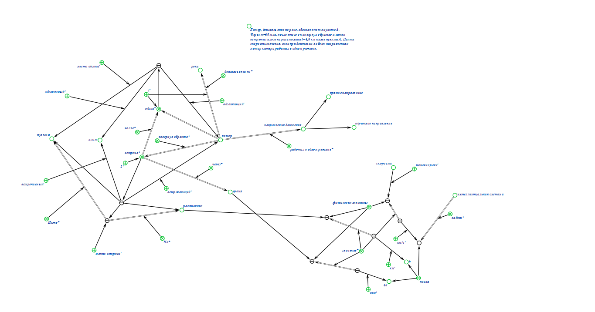
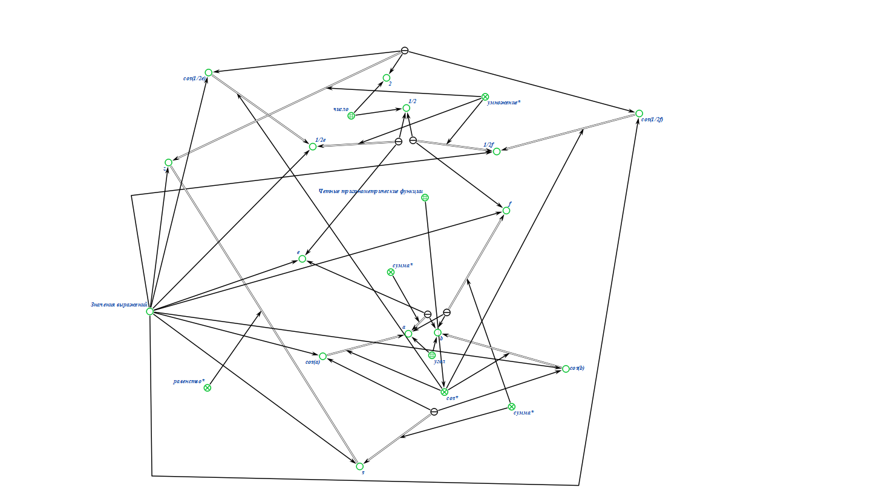
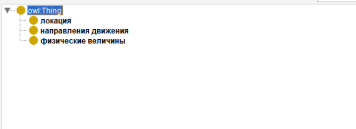
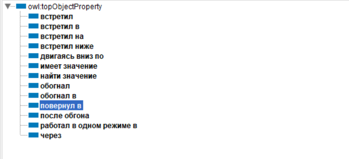
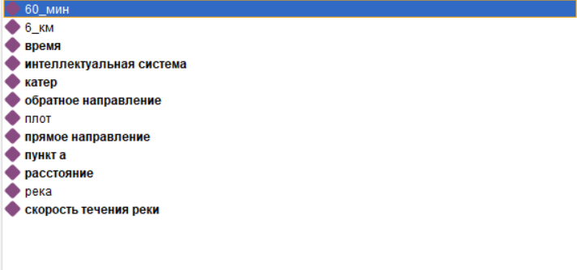

# Отчет по ПЗ

## Задание 1(вариант 6)

## Задание 2(вариант 1)

## Задание 1(вариант 6 в protege)
### классы

### отношение объектов

### сущности

Во время выполнения практического задания пользовался помощью студента Горячева Ильи

ссылка на github: https://github.com/iis-32170x/RPIIS/tree/Горячев_И
## Вывод

В ходе проделанной работы были приобритены навыки формализации.
