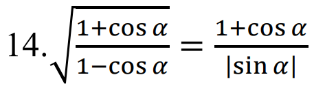

##Вариант 23

```Фредерик Франсуа Шопен (Фредерик Францишек Шопен; 22 февраля 1810, деревня Желязова Воля, близ Варшавы — 17 октября 1849, Париж) — польский композитор и пианист-виртуоз, педагог. По-новому истолковал многие жанры: возродил на романтической основе прелюдию, опоэтизировал и драматизировал танцы — мазурку, полонез, вальс; превратил скерцо в самостоятельное произведение. Среди сочинений Шопена 2 концерта (1829, 1830), 3 сонаты (1828—1844), фантазия (1841), 4 баллады (1835—1842), 4 скерцо (1832—1842), экспромты, ноктюрны, этюды, вальсы, мазурки, полонезы, прелюдии и другие произведения для фортепиано; песни.```

Данный текст был формализован в формате SCg-кода (gwf) и Protege (rdf). Файлы находятся в репозитории.

##Вариант 14



Данная формула была формализована в формате SCg-кода (gwf). Файл находится в репозитории.