# Расчётная работа

## Цель:
Продемонстрировать работу программы решения теоретико-графовой задачи по проверке наличия Гамильтонова цикла в графе в семантической памяти.

## Ключевые понятия:
*Граф* – совокупность двух множеств — множества самих объектов (вершин) и множества их парных связей (ребер/дуг)

*Неориентированный граф*  — граф, рёбра которого направления не имеют.

*Ориентированный граф*  — граф, дуги которого имеют направление.

*Гамильтонов цикл* – цикл (замкнутый путь), который проходит через каждую вершину данного графа ровно по одному разу.

*Гамильтонов граф* – граф, который имеет *гамильтонов цикл*.

## Выполнение задания
### Демонстрация работы программы в семантической памяти
Входные данные: `graph`

1. Задаём переменные `path`, `visited_nodes_count`, `current` и `initial`

2. Создаём первую волну, указывающую на вершину графа.

3. Создаём следующую волну, перемещаем указатель current на следующую вершину, обновляем переменные `_visited_nodes_count`, `wave_list_tail`, `new wave`.

4. Создаём следующую волну, перемещаем указатель current на следующую вершину, обновляем переменные `_visited_nodes_count`, `wave_list_tail`, `new wave`.

5. Создаём следующую волну, перемещаем указатель current на следующую вершину, обновляем переменные `_visited_nodes_count`, `wave_list_tail`, `new wave`.

6. Создаём следующую волну, перемещаем указатель current на следующую вершину, обновляем переменные `_visited_nodes_count`, `wave_list_tail`, `new wave`.

7. Обновляем переменные `_visited_nodes_count`, `new wave`.

8. Так как `path` = `visited_nodes_count`, то проверяем, существует ли дуга между значением `current` и `initial`. 

9. Так как дуга не существует, то удаляем волну `wave_list_tail`, создаем переменную `has_been_visited`, обновляем переменные `current`, `wave_list_tail`, `visited_nodes_count`.

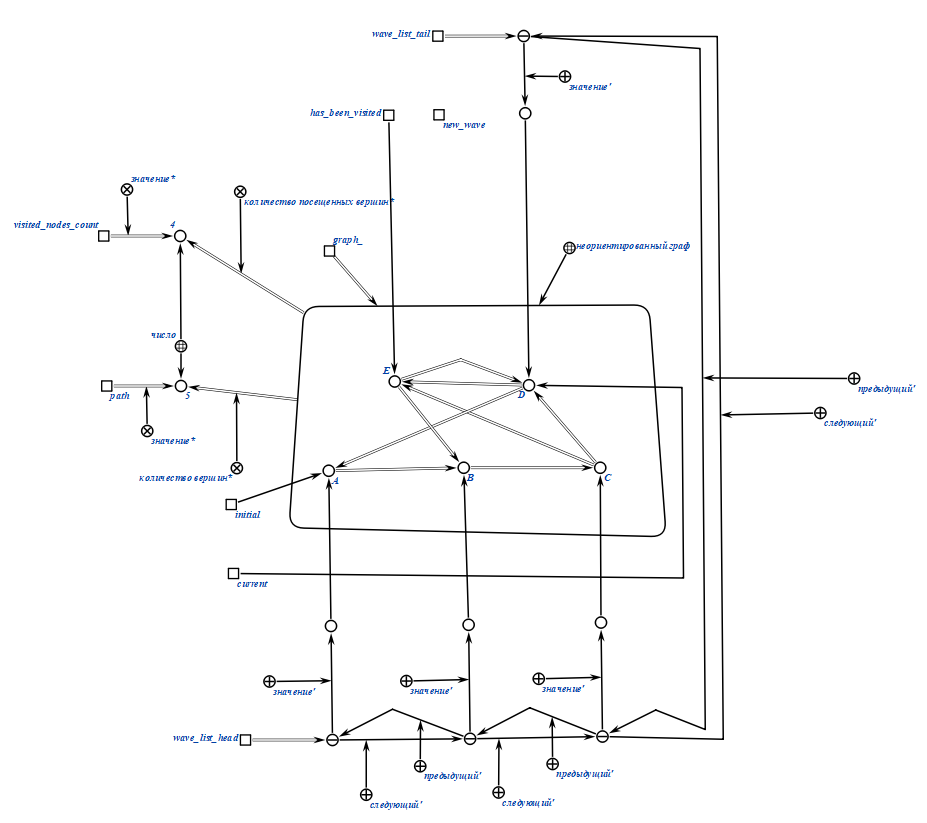

10. Так как из вершины `current` нет вершин, которые не входят в путь и не принадлежат переменной `has_been_visited`, то удаляем волну `wave_list_tail`, обновляем переменные `has_been_visited`, `current`, `wave_list_tail`, `visited_nodes_count`.

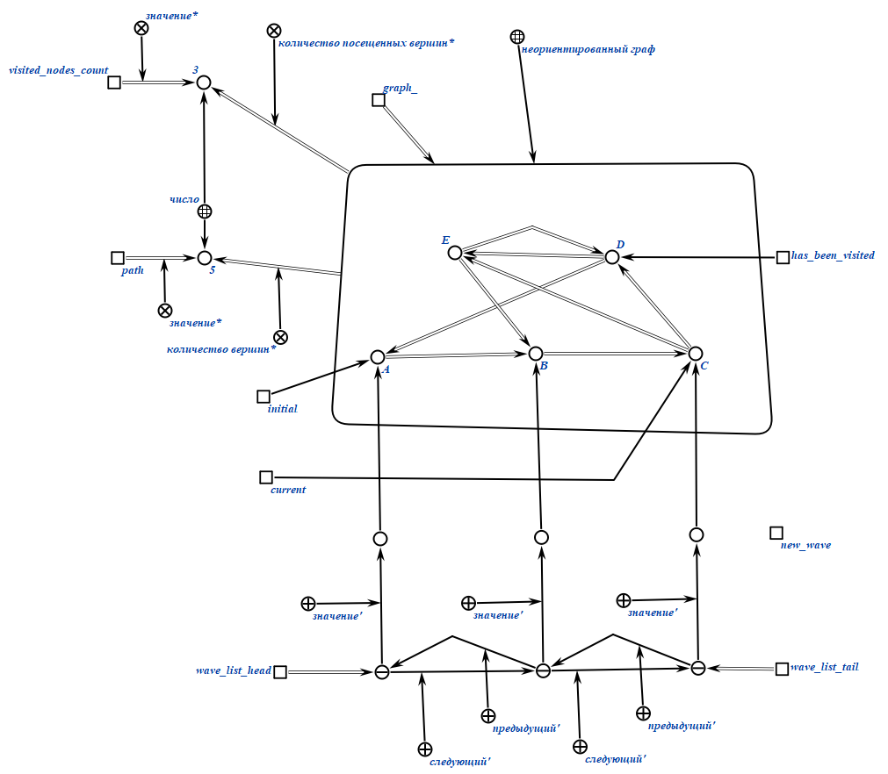

11. Создаём следующую волну, перемещаем указатель current на следующую вершину, обновляем переменные `wave_list_tail`, `new wave`.

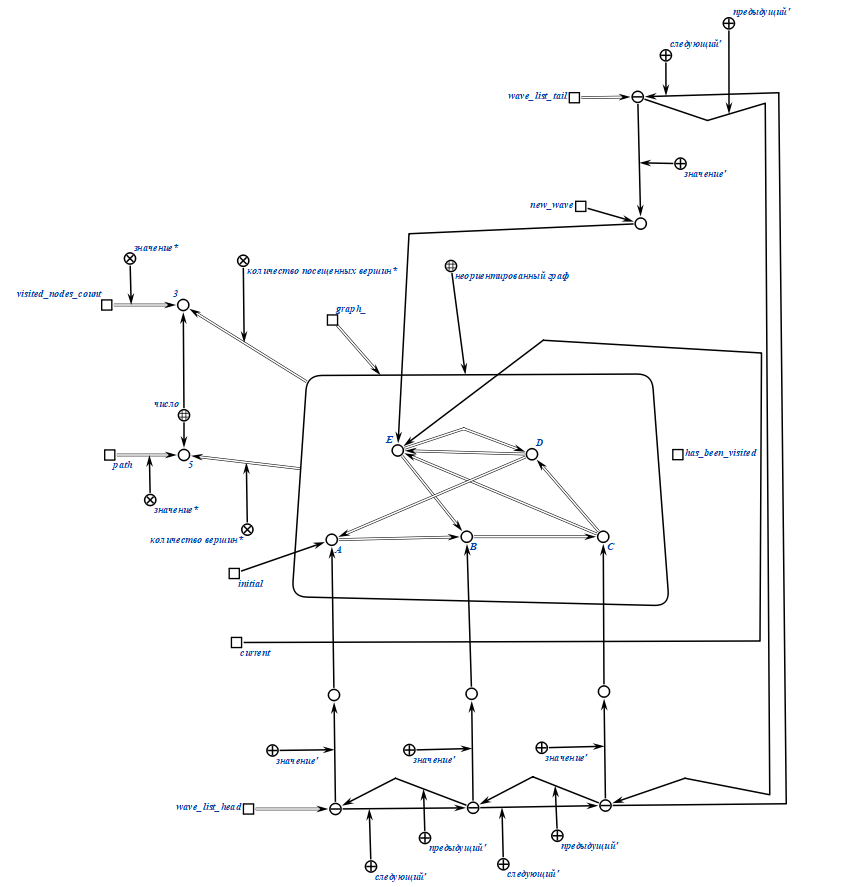

12. Создаём следующую волну, перемещаем указатель current на следующую вершину, обновляем переменные `wave_list_tail`, `new wave`.

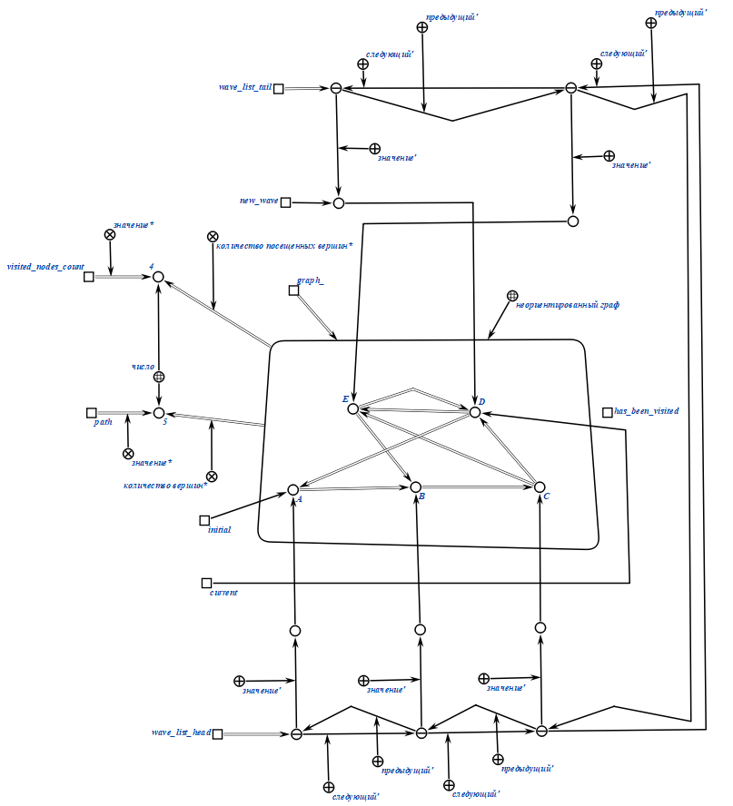

13. Обновляем переменные `wave_list_tail`, `new wave`.
    
14. Так как `path` = `visited_nodes_count`, то проверяем, существует ли дуга между значением `current` и `initial`. 

15. Так как дуга существует, значит мы прошли по всем вершинам и вернулись в изначальную, алгоритм выполнен.

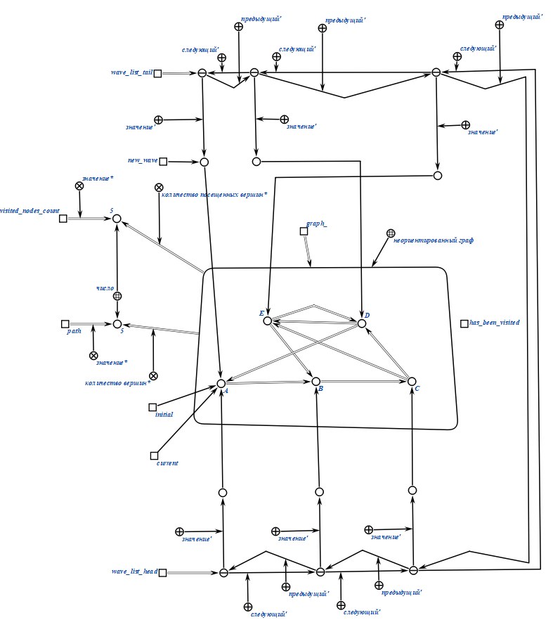

16. Удаляем все переменные, кроме `graph`, включаем граф во множество *гамильтонов граф*.

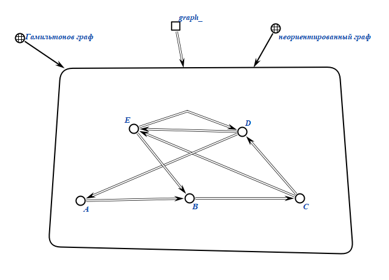

## Примеры
### Пример 1.
   Входные данные:
   
   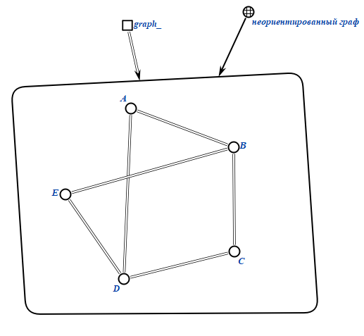
   
   Результат:
   
   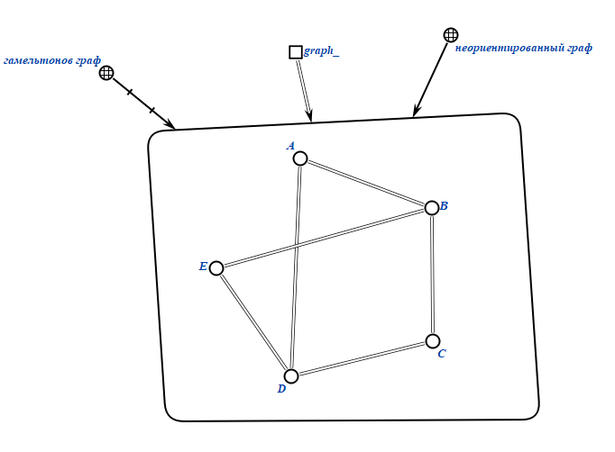
### Пример 2.
   Входные данные:
   
   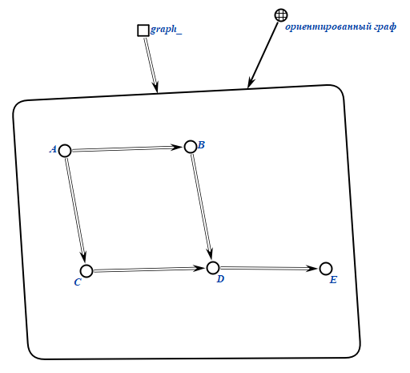
   
   Результат:
   
   
### Пример 3.
   Входные данные:
   
   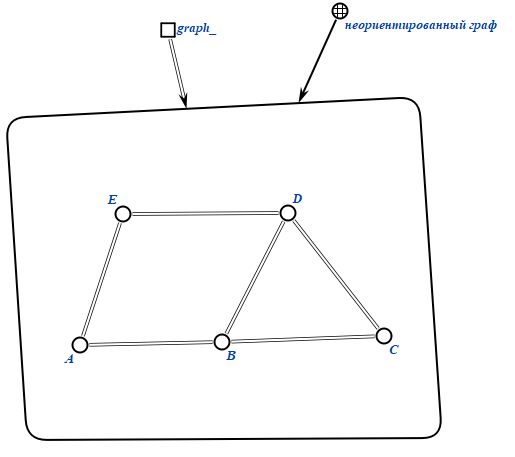
   
   Результат:
   
   
### Пример 4.
   Входные данные:
   
   
   
   Результат:
   
   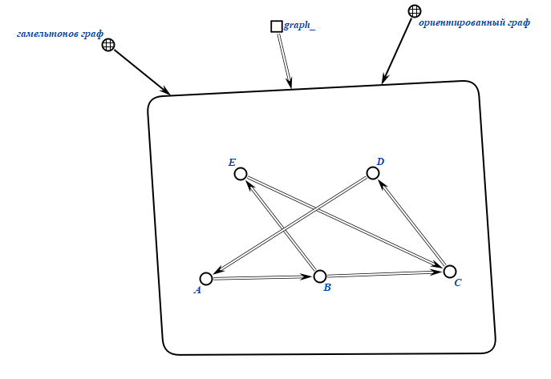
## Вывод

В результате выполнения данной расчётной работы был формализован алгоритм *проверки на наличие гамильтонова цикла* в неориентированных и ориентированных графах, были изучены:

- Основы теории графов

- Способы представления графов

- Базовые алгоритмы для работы с графами

- Основы SC-кода и SC-алфавита

- Базовые знания о SCg-коде

- Правила формирования идетификаторов sc-элементов

## Источники

- [Руководство к выполнению РР](https://drive.google.com/drive/folders/1RSriLOZWpxyozHjUa1Kz3uZtIr0PixVh)
