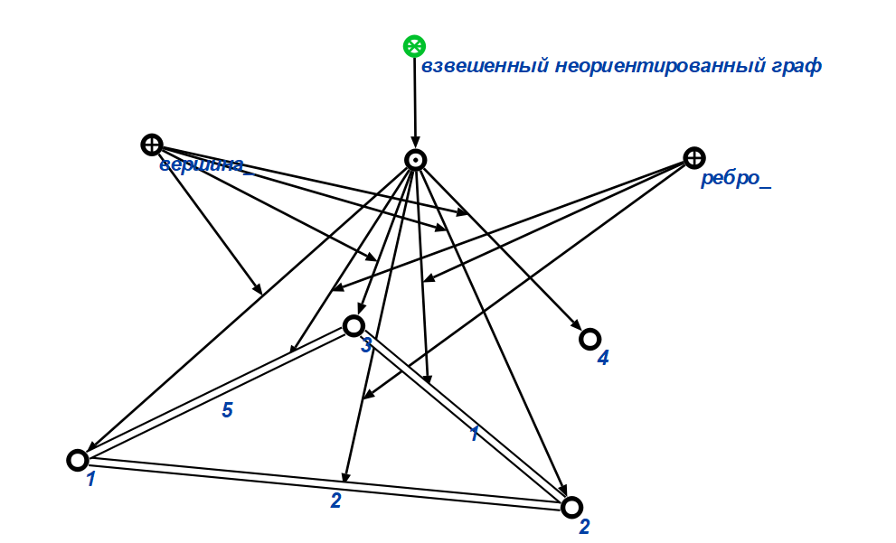

# Расчетная работа по ПиОИвИС
# Цель работы:
Формализовать понятия, используемые в работе, а также формализовать алгоритм выполнения работы при помощи SCg-кода.
# Задачи:
- дать определения понятиям, использумых в работе, на естественном языке, а также определить их тип(абсолютное или относительное);  
- формализовать понятия при помощи SCg-кода;  
- погрузить формализованные понятия в базу знаний интеллектуальной системы на основе Технологии OSTIS;
- продемонстрировать тестовые примеры в виде перечня входных-выходных конструкций;
- при помощи SCg-кода формализовать алгоритм выполнения работы.
# Задание(вариант 5.17):
Найти циклы указанной длины в взвешенном неориентированном графе.
# Список понятий:
- взвешенный неориентированный граф(абсолютное понятие) - граф, в котором все связки являются ребрами, каждому из которых поставлено в соответствие некоторое значение(вес ребра):  
  
- цикл графа(относительное понятие) - замкнутая цепь этого графа:  
  
# Формализованные понятия в OSTIS GT:
  
# Тестовые примеры:  
1) **Вход:** необходимо найти циклы длины 5.  
  
**Выход:** циклов длины 5 нет.  
2) **Вход:** необходимо найти циклы длины 7.  
  
**Выход:** циклов длины 7 нет.  
3) **Вход:** необходимо найти циклы длины 10.  
  
**Выход:** циклов длины 10 нет.  
4) **Вход:** необходимо найти циклы длины 9.  
  
**Выход:** будут найдены все циклы длины 9:  
- 1->2->3->1  

- 1->2->3->1  

- 2->1->3->2  

- 2->3->1->2  

- 3->1->2->3  
  
- 3->2->1->3  
  
5)**Вход:** необходимо найти циклы длины 9.
  
**Выход:** будут найдены все циклы длины 9:  
- 1->2->3->1  
  
- 1->2->3->1  
  
- 2->1->3->2  
  
- 2->3->1->2  
  
- 3->1->2->3  
  
- 3->2->1->3  

# Алгоритм выполнения работы на ественном языке:

# Формализованный алгоритм выполнения работы:

# Вывод:
В результате работы при помощи SCg-кода были формализованы понятия, используемые в расчетной работе, а также алгоритм выполнения задания.
# Список использованных источников:  
1) 
