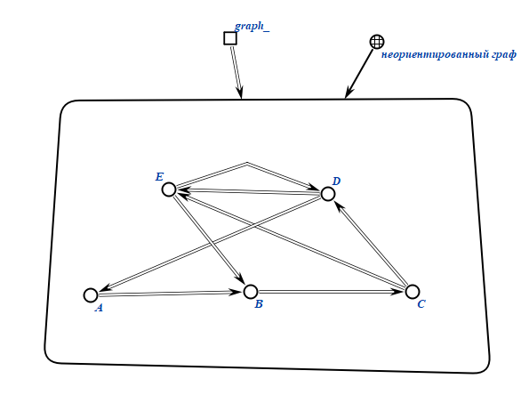

# Расчётная работа по дисциплине ПиОИвИС, второй семестр

## Цель:

## Условие задания 5.3.
Продемонстрировать работу программы решения теоретико-графовой задачи по проверке наличия Гамильтонова цикла в графе в семантической памяти.

## Ключевые понятия:
*Граф* – совокупность двух множеств — множества самих объектов и множества их парных связей.

*Неориентированный граф*  — граф, рёбра которого направления не имеют.

*Матрица смежности* – способ представления графа, описывающий связи между его вершинами.

*Гамильтонов цикл* – цикл (замкнутый путь), который проходит через каждую вершину данного графа ровно по одному разу.

*Гамильтонов граф* – граф, который имеет *гамильтонов цикл*.

## Выполнение задания
### Демонстрация работы программы в семантической памяти
1. Задаём граф, переменные `path`, `_visited_vertexes_count`, `current` и `initial`

Демонстрация погрузки в базу знаний:

2. Создаём первую волну, указывающую на вершину графа.

3. Создаём следующую волну, перемещаем указатель current на следующую вершину, обновляем переменную `_visited_vertexes_count`.

4. Создаём следующую волну, перемещаем указатель current на следующую вершину, обновляем переменную `_visited_vertexes_count`.

5. Создаём следующую волну, перемещаем указатель current на следующую вершину, обновляем переменную `_visited_vertexes_count`.

6. Создаём следующую волну, перемещаем указатель current на следующую вершину, обновляем переменную `_visited_vertexes_count`.

7. Создаём следующую волну, перемещаем указатель current на следующую вершину, обновляем переменную `_visited_vertexes_count`.

8. Генерация пути:

Демонстрация погрузки в базу знаний:

9. `current` = `initial`, а также `_path` = `_visited_vertexes_count`, значит мы прошли по всем вершинам и вернулись в изначальную, алгоритм выполнен.

Демонстрация погрузки в базу знаний:

# Вывод

В результате выполнения данной расчётной работы был формализован алгоритм *проверки на наличие гамильтонова цикла* в неориентированных и ориентированных графах, были изучены:

- Основы теории графов

- Способы представления графов

- Базовые алгоритмы для работы с графами

- Основы SC-кода и SC-алфавита

- Базовые знания о SCg-коде

- Правила формирования идетификаторов sc-элементов

# Источники

- [Руководство к выполнению РР](https://drive.google.com/drive/folders/1RSriLOZWpxyozHjUa1Kz3uZtIr0PixVh)
