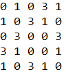
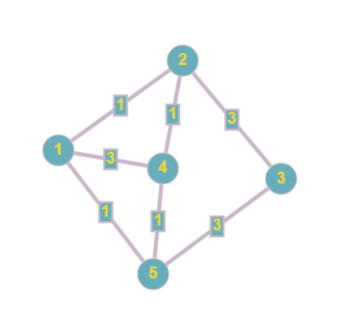

# Расчетная работа по ПиОИвИС
## Условие расчетной работы(вариант 5.17)
Найти циклы указанной длины. Взвешенный неориентированный граф задается матрицей смежности.
## Алгоритм решения задачи
1. Считывание с файла matrix.txt число n - порядок матрицы смежности(количество вершин графа)
2. Считывание с файла matrix.txt элементы матрицы смежности, записывая их в элементы двумерного вектора gr
3. Ввод длины циклов графа, которые необходимо найти. Значение записывается в переменную len
4. Совершение обхода в глубину по графу с целью найти все циклы:
   4.1. аа
5. Вывод только тех циклов, длина которых равна значению len   
## Матрица смежности графа и граф
 

## Код на С++

## Результат
