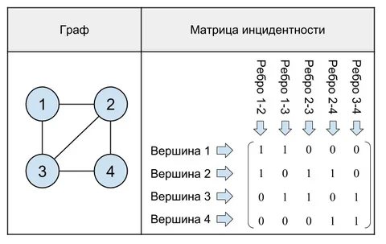

# Расчётная работа

## Цель

Цель работы - изучить основы теории графов, способы представления графов, базовые алгоритмы для работы с разными видами графов.

### Задание

Реализовать код на языке `С++`, который, используя в качестве способа выражения графа матрицу инцидентности, будет находить минимальный простой разрез графа.

### Ключевые понятия

`Граф` — математическая абстракция реальной системы любой природы, объекты которой обладают парными связями.

`Матрица инцидентности` — одна из форм представления графа, в которой указываются связи между инцидентными элементами графа (ребро(дуга) и вершина). Столбцы матрицы соответствуют ребрам, строки — вершинам. Ненулевое значение в ячейке матрицы указывает связь между вершиной и ребром (их инцидентность).

Пример: 

`Разрез графа` — это разбиение вершин графа на два непустых непересекающихся подмножества.

Пример: 

`Минимальный разрез графа` — разрез, при котором размер или вес разреза не превышает размер любого другого разреза. Для невзвешенного графика минимальным разрезом будет просто разрез с наименьшим количеством ребер. Для взвешенного графика сумма весов всех ребер на разрезе определяет, является ли это минимальным разрезом. 

## Алгоритм выполнения задания

Задача минимального разреза в невзвешенных графах может быть решена с помощью алгоритма Каргера, в взвешенных - с помощью алгоритма Стоера-Вагнера.

### Алгоритм Каргера

Основной операцией алгоритма Каргера является одна из форм стягивания ребра. Для выполнения этой операции на произвольном ребре *e = {u, v}* происходит объединение вершин графа *u* и *v* в одну *uv*. Если удаляется вершина *v*, то каждое ребро вида *{v, x}* заменяется на ребро вида *{u, x}*. Петли удаляются, и после этой операции граф не содержит петель.

Алгоритм представляет собой равновероятный выбор случайного имеющегося ребра и объединение вершин согласно описанной операции. Результатом работы алгоритма является пара вершин, множество рёбер между которыми является разрезом графа. Этот разрез может быть не минимальным, но вероятность того, что этот разрез минимальный существенно больше, чем для случайно выбранного разреза. А при повторении данного алгоритма шансы найти именно минимальный разрез сильно возрастают.

### Алгоритм Стоера-Вагнера

Идея алгоритма довольно проста. Будем n−1 раз повторять следующий процесс: находить минимальный разрез между какой-нибудь парой вершин s и t, а затем объединять эти две вершины в одну. В конце концов, после n−1 итерации, останется одна вершина. После этого ответом будет являться минимальный среди всех n−1 найденных разрезов. Действительно, на каждой i-ой стадии найденный минимальный разрез <A,B> между вершинами si и ti либо окажется искомым глобальным минимальным разрезом, либо же, напротив, вершины si и ti невыгодно относить к разным множествам, поэтому мы ничего не ухудшаем, объединяя эти две вершины в одну.

Следовательно нам необходимо для данного графа найти минимальный разрез между какой-нибудь парой вершин s и t. Для этого вводим некоторое множество вершин A, которое изначально содержит единственную произвольную вершину s. На каждом шаге находится вершина, наиболее сильно связанная с множеством A, т.е. вершина v $ ∉ $ A, для которой следующая величина $ w(v,A)=∑(v,u)∈E,u∈Aw(v,u) $ максимальна (максимальна сумма весов рёбер, один конец которых v, а другой принадлежит A). Этот процесс завершится, когда все вершины перейдут в множество A.

## Вывод
 
В результате выполнения данной работы были получены следующие практические навыки:
- изучены основы теории графов
- изучены способы представления графов
- изучены базовые алгоритмы для работы с графами 