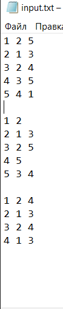

# Расчетная работа 
---
### Цель: 
Изучить основы теории графов, способы представления графов, базовые алгоритмы для работы с графами
### Вариант 4.9
С помощью С++ реализовать нахождение пересечения множества неориентированных графов. Графы представляются в виде списка смежности (списка инцидентности).
### Ключевые понятия 
___
__Граф__ - математическая абстракция реальной системы любой природы, объекты которой обладают парными связями.

__Неориентированный граф (кратко нг)__ — граф, рёбрам которого не присвоено направления.

__Список смежности__ - один из способов представления графа в виде коллекции списков вершин. Каждой вершине графа соответствует список, состоящий из «соседей» этой вершины.

__Пересечение графов__ — операция над графами, в результате которой получается граф, множества вершин и рёбер которого являются пересечениями множеств вершин и рёбер исходных графов.
__Обход в глубину__ заключается в систематическом просмотре вершин графа и прохождении его ветвями. Иными словами, идея поиска в глубину — когда возможные пути по рёбрам, выходящим из вершин, разветвляются, нужно сначала полностью исследовать одну ветку и только потом переходить к другим веткам (если они останутся нерассмотренными).

#### Пример обхода в глубину

***
### Алгоритм решения 
Создать пустое множество для отслеживания посещенных вершин.

Для каждого графа в множестве:

* Вызвать функцию dfs для каждой вершины графа, передавая текущую вершину и множество посещенных вершин.

В функции dfs:
* Если вершина уже посещена, вернуться и продолжить обход с другой непосещенной вершины.
* Поместить вершину в множество посещенных вершин.
* Обработать вершину, если это необходимо (например, добавьте его в результат или выполните другие операции).
* Получить соседей вершины из соответствующего графа.

 Для каждого соседа:
* Рекурсивно вызвать функцию dfs для соседа и множества посещенных вершин.
---
### Реализация на C++
Код, выполняющий поставленную задачу:
```C++
#include <iostream>
#include <fstream>
#include <sstream>
#include <unordered_map>
#include <unordered_set>
#include <vector>

using namespace std;

unordered_map<int, unordered_set<int>> findGraphIntersection(const vector<unordered_map<int, unordered_set<int>>>& graphs) {
    if (graphs.empty()) {
        return {};
    }

    unordered_map<int, unordered_set<int>> intersectionGraph = graphs[0];

    for (size_t i = 1; i < graphs.size(); ++i) {
        const unordered_map<int, unordered_set<int>>& currentGraph = graphs[i];
        unordered_map<int, unordered_set<int>> newIntersectionGraph;

        for (const auto& vertexNeighbors : currentGraph) {
            int vertex = vertexNeighbors.first;

            if (intersectionGraph.count(vertex) > 0) {
                const unordered_set<int>& neighbors = vertexNeighbors.second;
                unordered_set<int> commonNeighbors;

                for (int neighbor : neighbors) {
                    if (intersectionGraph[vertex].count(neighbor) > 0) {
                        commonNeighbors.insert(neighbor);
                    }
                }

                if (!commonNeighbors.empty()) {
                    newIntersectionGraph[vertex] = commonNeighbors;
                }
            }
        }

        intersectionGraph = std::move(newIntersectionGraph);
    }

    unordered_map<int, unordered_set<int>> finalIntersectionGraph = intersectionGraph;

    for (const auto& vertexNeighbors : graphs[0]) {
        int vertex = vertexNeighbors.first;
        bool isCommonVertex = true;

        for (size_t i = 1; i < graphs.size(); ++i) {
            const unordered_map<int, unordered_set<int>>& currentGraph = graphs[i];
            if (currentGraph.count(vertex) == 0) {
                isCommonVertex = false;
                break;
            }
        }

        if (isCommonVertex && finalIntersectionGraph.count(vertex) == 0) {
            finalIntersectionGraph[vertex] = {};
        }
    }

    return finalIntersectionGraph;
}

int main() {
    setlocale(LC_ALL, "RU");

    string inputFileName = "input.txt";
    string outputFileName = "output.txt";

    ifstream inputFile(inputFileName);
    if (!inputFile) {
        cerr << "Не удалось открыть входной файл " << inputFileName << endl;
        return 1;
    }

    vector<unordered_map<int, unordered_set<int>>> graphs;
    unordered_map<int, unordered_set<int>> graph;
    string line;
    while (getline(inputFile, line)) {
        if (line.empty()) {
            if (!graph.empty()) {
                graphs.push_back(graph);
                graph.clear();
            }
        }
        else {
            istringstream iss(line);
            int vertex;
            iss >> vertex;
            int neighbor;
            while (iss >> neighbor) {
                graph[vertex].insert(neighbor);
            }
        }
    }
    if (!graph.empty()) {
        graphs.push_back(graph);
    }
    inputFile.close();

    unordered_map<int, unordered_set<int>> intersectionGraph = findGraphIntersection(graphs);

    ofstream outputFile(outputFileName);
    if (!outputFile) {
        cerr << "Не удалось открыть выходной файл: " << outputFileName << endl;
        return 1;
    }

    for (const auto& vertexNeighbors : intersectionGraph) {
        int vertex = vertexNeighbors.first;
        const unordered_set<int>& neighbors = vertexNeighbors.second;

        outputFile << vertex;
        for (int neighbor : neighbors) {
            outputFile << " " << neighbor;
        }
        outputFile << endl;
    }
    outputFile.close();

    cout << "Пересечение графов записано в файл " << outputFileName << endl;

    return 0;
}
```
### Комментарии к программе 
```unordered_map<int, unordered_set<int>> findGraphIntersection(const vector<unordered_map<int, unordered_set<int>>>& graphs) {``` объявление функции findGraphIntersection, которая принимает вектор graphs в качестве аргумента и возвращает unordered_map, представляющую пересечение графов.
```unordered_map<int, unordered_set<int>> intersectionGraph = graphs[0];```Инициализация переменной intersectionGraph копией первого графа из вектора graphs.
```for (size_t i = 1; i < graphs.size(); ++i) { const unordered_map<int, unordered_set<int>>& currentGraph = graphs[i]; unordered_map<int, unordered_set<int>> newIntersectionGraph;``` Цикл, который проходит по оставшимся графам вектора graphs. В каждой итерации объявляется переменная currentGraph, содержащая ссылку на текущий граф, и переменная newIntersectionGraph, которая будет хранить новое пересечение графов.
```for (const auto& vertexNeighbors : currentGraph) { int vertex = vertexNeighbors.first;``` Цикл, который перебирает все вершины и соседей в текущем графе. В каждой итерации переменная vertex принимает значение вершины.
```if (intersectionGraph.count(vertex) > 0) {const unordered_set<int>& neighbors = vertexNeighbors.second; unordered_set<int> commonNeighbors``` Проверка, содержит ли intersectionGraph вершину vertex. Если содержит, то объявляются переменные neighbors, которая хранит соседей вершины vertex, и commonNeighbors, которая будет хранить общих соседей между vertex и intersectionGraph.
```if (!commonNeighbors.empty()) { newIntersectionGraph[vertex] = commonNeighbors;}```
Если commonNeighbors не пустой, то он добавляется в newIntersectionGraph по ключу vertex.
```for (const auto& vertexNeighbors : graphs[0]) {int vertex = vertexNeighbors.first; bool isCommonVertex = true;}``` Цикл, который перебирает вершины и соседей в первом графе graphs[0]. В каждой итерации переменная vertex принимает значение вершины, а переменная isCommonVertex инициализируется значением true.
```if (isCommonVertex) {finalIntersectionGraph[vertex] = vertexNeighbors.second;}```Если переменная isCommonVertex осталась true, то вершина vertex и ее соседи (vertexNeighbors.second) добавляются в finalIntersectionGraph.

---
### Тестирование 
 Графическое изображение исходных графов:


Итоговый граф: 


Представление графов в виде списка смежности:



Запуск программы:


В результате получили ожидаемый ответ. 

---
###Вывод 
В результате выполнения расчётной работы приобрела следующие навыки:

* научилась определять графы и их компоненты, как вершины и ребра связаны между собой.
* изучила обход в глубину.
* научилась находить пересечение графов.
* научилась использовать алгоритмы на графах.
* изучила базовые алгоритмы работы с файлами в C++.
---
### Список литературы
[1] Оре О. Теория графов. – 2-е изд.. – М.: Наука, 1980. – С. 336.

[2] Кормен Т. Х. и др. Часть VI. Алгоритмы для работы с графами // Алгоритмы: построение
и анализ = Introduction to Algorithms. – 2-е изд.. – М.: Вильямс, 2006. – С. 1296.

[3] Харари, Ф. Теория графов / Ф. Харари / Пер. с англ. и предисл. В.П. Козырева. Под ред.
Г.П. Гаврилова. Изд. 2-е. – М.: Едиториал УРСС, 2003. – 269 с.

[4] Нечипуренко, М. И. Алгоритмы и программы решения задач на графах и сетях / М.И.
Нечипуренко, В.К. Попков, С.М. Майнагашев и др. – Новосибирск: Наука. Сиб. отд-ние,
1990. – 515 с.

[5] Емеличев В. А., Мельников О. И., Сарванов В. И., Тышкевич Р. И. Лекции по теории
графов. М.: Наука, 1990. 384с. (Изд.2, испр. М.: УРСС, 2009. 392 с.)

[6] Касьянов, В. Н. Графы в программировании: обработка, визуализация и применение / В.
Н. Касьянов, В. А. Евстигнеева. – СПб. : БХВ-Петербург, 2003.

[7] База знаний по теории графов OSTIS GT [Электронный ресурс] / проект OSTIS, 2012. –
Режим доступа: http://ostisgraphstheo.sourceforge.net. — Дата доступа : 11.09.2012.