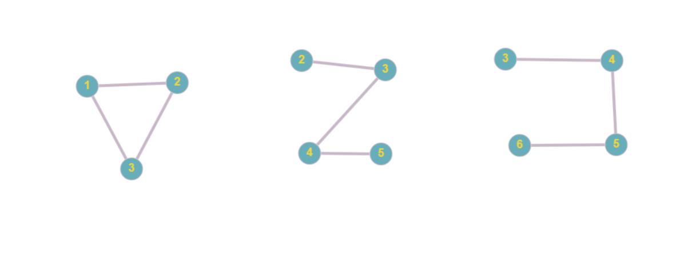
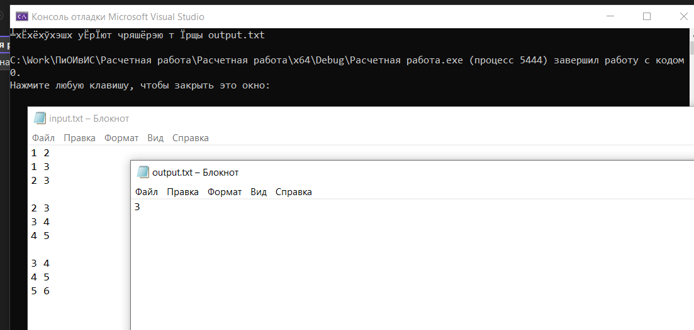

# Расчетная работа 
---
### Цель: 
Изучить основы теории графов, способы представления графов, базовые алгоритмы для работы с графами
### Вариант 4.9
С помощью С++ реализовать нахождение пересечения множества неориентированных графов. Графы представляются в виде списка смежности (списка инцидентности).
### Ключевые понятия 
___
__Граф__ - математическая абстракция реальной системы любой природы, объекты которой обладают парными связями.

__Неориентированный граф (кратко нг)__ — граф, рёбрам которого не присвоено направления.

__Список смежности__ - один из способов представления графа в виде коллекции списков вершин. Каждой вершине графа соответствует список, состоящий из «соседей» этой вершины.

__Пересечение графов__ — операция над графами, в результате которой получается граф, множества вершин и рёбер которого являются пересечениями множеств вершин и рёбер исходных графов.
***
### Алгоритм решения 
1. Выберите произвольный граф из множества графов и пометьте его вершины как посещенные.
2. Для каждого оставшегося графа в множестве графов:
    * Проверьте каждую вершину в текущем графе и проверьте, принадлежит ли она предыдущему посещенному графу.
    * Если вершина принадлежит каждому графу, добавьте ее в пересечение графов.
3. По завершении цикла по всем графам, пересечение графов будет содержать вершины, которые присутствуют в каждом из графов.

Приведем пример алгоритма для поиска пересечения графов. Исходные графы:

Представим эти графы в виде списка смежности:
* Первый граф:
>1 - 2
1 - 3
2 - 3
* Второй граф:
>2 - 3
3 - 4
4 - 5
* Третий граф:
>3 - 4
4 - 5
5 - 6

1. Выберем первый граф и пометим его вершины как посещенные: 1, 2, 3.

2. Применим алгоритм для оставшихся графов:

    * Граф 2:
    Проверим каждую вершину в текущем графе (2, 3, 4, 5) и проверим, принадлежит ли она предыдущему посещенному графу (1, 2, 3).
В данном случае, вершины 2 и 3 принадлежат предыдущему графу, поэтому они входят в пересечение графов.

    * Граф 3:
    Проверим каждую вершину в текущем графе (3, 4, 5, 6) и проверим, совпадает ли она с полученным пересечением (2, 3).
В данном случае, вершина 3 совпадает, поэтому она входит в пересечение графов. Остальные вершины не принадлежат предыдущим графам, поэтому они не входят в пересечение графов.

3. В результате применения алгоритма ко всем графам, пересечение графов будет содержать вершины, которые присутствуют в каждом из графов. В данном случае, пересечение графов будет состоять из вершины 3.
---
### Реализация на C++
Код, выполняющий поставленную задачу:
```C++
#include <iostream>
#include <fstream>
#include <sstream>
#include <unordered_set>
#include <vector>
#include <unordered_map>

using namespace std;

vector<unordered_set<int>> readGraphsFromFile(const string& filename) {
    ifstream file(filename);
    vector<unordered_set<int>> graphs;
    unordered_set<int> currentGraph;

    string line;
    while (getline(file, line)) {
        if (line.empty()) {
            graphs.push_back(currentGraph);
            currentGraph.clear();
        }
        else {
            istringstream iss(line);
            int vertex;
            while (iss >> vertex) {
                currentGraph.insert(vertex);
            }
        }
    }

    if (!currentGraph.empty()) {
        graphs.push_back(currentGraph);
    }

    return graphs;
}


unordered_set<int> findGraphIntersection(const vector<unordered_set<int>>& graphs) {
    if (graphs.empty()) {
        return unordered_set<int>(); 
    }

    unordered_set<int> intersection = graphs[0];

    for (size_t i = 1; i < graphs.size(); ++i) {
        const unordered_set<int>& currentGraph = graphs[i];
        unordered_set<int> newIntersection;

        
        for (int vertex : currentGraph) {
            if (intersection.count(vertex) > 0) {
                newIntersection.insert(vertex);
            }
        }

       
        intersection = newIntersection;
    }

    return intersection;
}

void writeIntersectionToFile(const string& filename, const unordered_set<int>& intersection) {
    ofstream file(filename);
    if (!file) {
        cerr << "Ошибка при открытии файла для записи." << endl;
        return;
    }

    for (int vertex : intersection) {
        file << vertex << endl;
    }

    file.close();

    cout << "Пересечение графов записано в файл " << filename << endl;
}

int main() {
    string inputFilename = "input.txt"; 
    string outputFilename = "output.txt"; 

    vector<unordered_set<int>> graphs = readGraphsFromFile(inputFilename); 
    unordered_set<int> intersection = findGraphIntersection(graphs); 
    writeIntersectionToFile(outputFilename, intersection);

    return 0;
}
```
### Комментарии к программе 
Функция ```readGraphsFromFile(const string& filename)```:
* ```ifstream file(filename);``` - Открывает файл с именем filename для чтения.
* ```vector<unordered_set<int>> graphs;``` - Объявляет вектор graphs, который будет содержать все графы из файла.
* ```unordered_set<int> currentGraph;``` - Объявляет пустой набор currentGraph, который будет использоваться для хранения вершин текущего графа.
* ```string line;``` - Объявляет строковую переменную line, которая будет использоваться для считывания строк из файла.
* ```while (getline(file, line))``` - Цикл, который считывает строки из файла поочередно в переменную line до тех пор, пока считывание возможно.
* ```if (line.empty())``` - Проверяет, является ли текущая строка пустой. Если строка пустая, это означает, что закончился текущий граф и нужно добавить его в вектор graphs.
* ```graphs.push_back(currentGraph);``` - Добавляет текущий граф в вектор graphs.
* ```currentGraph.clear();``` - Очищает текущий граф, чтобы подготовить его для следующего графа.
```else``` - Если текущая строка не пустая, это означает, что она содержит вершины текущего графа.
* ```istringstream iss(line);``` - Создает поток iss для разбора строки line на отдельные числа.
* ```int vertex;``` - Объявляет переменную vertex, которая будет использоваться для считывания чисел из строки.
* ```while (iss >> vertex)``` - Цикл, который считывает числа из потока iss в переменную vertex до тех пор, пока считывание возможно.
* ```currentGraph.insert(vertex);``` - Добавляет вершину vertex в текущий граф currentGraph.
* По завершении цикла, если currentGraph не пустой, это означает, что последний граф в файле не был завершен разделителем. В этом случае, он добавляется в вектор graphs.
* В конце функция возвращает вектор graphs, содержащий все считанные графы из файла.

Функция ```findGraphIntersection(const vector<unordered_set<int>>& graphs)```:
* ```if (graphs.empty())``` - Проверяет, является ли вектор графов пустым. Если да, то возвращается пустой набор ```unordered_set<int>```, так как пересечение не может быть найдено.
* ```unordered_set<int> intersection = graphs[0];``` - Инициализирует набор intersection пересечением с первым графом из вектора graphs.
* ```for (size_t i = 1; i < graphs.size(); ++i)``` - Цикл, который итерируется по остальным графам, начиная со второго графа.
* ```const unordered_set<int>& currentGraph = graphs[i];``` - Объявляет константную ссылку currentGraph, которая ссылается на текущий граф из вектора graphs.
* ```unordered_set<int> newIntersection;``` - Объявляет пустой набор newIntersection, который будет использоваться для хранения нового пересечения.
* ```for (int vertex : currentGraph)``` - Цикл, который итерируется по вершинам текущего графа currentGraph.
* ```if (intersection.count(vertex) > 0)``` - Проверяет, содержит ли набор intersection вершину vertex.
* ```newIntersection.insert(vertex);``` - Если вершина vertex содержится в intersection, она добавляется в newIntersection.
* ```intersection = newIntersection;``` - Обновляет intersection новым пересечением, найденным на текущей итерации цикла.
* По завершении цикла, функция возвращает набор intersection, который представляет пересечение графов.

Функция ```writeIntersectionToFile(const string& filename, const unordered_set<int>& intersection)```:
* ```ofstream file(filename);``` - Открывает файл с именем filename для записи.
* ```if (!file)``` - Проверяет, успешно ли открыт файл. Если нет, выводится сообщение об ошибке и функция завершается.
* ```for (int vertex : intersection)``` - Цикл, который итерируется по вершинам в наборе intersection.
* ```file << vertex << endl;``` - Записывает вершину vertex в файл, за которым следует символ новой строки.
* ```file.close();``` - Закрывает файл после записи.
* ```cout << "Пересечение графов записано в файл " << filename << endl;``` - Выводит сообщение о том, что пересечение графов было успешно записано в файл.

Функция ```main()```:
* ```string inputFilename = "input.txt";``` - Объявляет строковую переменную inputFilename и присваивает ей имя файла ввода.
* ```string outputFilename = "output.txt";``` - Объявляет строковую переменную outputFilename и присваивает ей имя файла вывода.
* ```vector<unordered_set<int>> graphs = readGraphsFromFile(inputFilename);``` - Объявляет вектор graphs и использует функцию ```readGraphsFromFile``` для чтения графов из файла в этот вектор.
* ```unordered_set<int> intersection = findGraphIntersection(graphs);```- Находит пересечение графов.

### Тестирование 

После выполнения программы в файле output.txt записан ожидаемый ответ.

---
###Вывод 
В результате выполнения расчётной работы приобрела следующие навыки:

* научилась определять графы и их компоненты, как вершины и ребра связаны между собой.
* научилась находить пересечение графов.
* научилась использовать алгоритмы на графах.
* изучила базовые алгоритмы работы с векторами, файлами в C++.
---
### Список литературы
[1] Оре О. Теория графов. – 2-е изд.. – М.: Наука, 1980. – С. 336.

[2] Кормен Т. Х. и др. Часть VI. Алгоритмы для работы с графами // Алгоритмы: построение
и анализ = Introduction to Algorithms. – 2-е изд.. – М.: Вильямс, 2006. – С. 1296.

[3] Харари, Ф. Теория графов / Ф. Харари / Пер. с англ. и предисл. В.П. Козырева. Под ред.
Г.П. Гаврилова. Изд. 2-е. – М.: Едиториал УРСС, 2003. – 269 с.

[4] Нечипуренко, М. И. Алгоритмы и программы решения задач на графах и сетях / М.И.
Нечипуренко, В.К. Попков, С.М. Майнагашев и др. – Новосибирск: Наука. Сиб. отд-ние,
1990. – 515 с.

[5] Емеличев В. А., Мельников О. И., Сарванов В. И., Тышкевич Р. И. Лекции по теории
графов. М.: Наука, 1990. 384с. (Изд.2, испр. М.: УРСС, 2009. 392 с.)

[6] Касьянов, В. Н. Графы в программировании: обработка, визуализация и применение / В.
Н. Касьянов, В. А. Евстигнеева. – СПб. : БХВ-Петербург, 2003.

[7] База знаний по теории графов OSTIS GT [Электронный ресурс] / проект OSTIS, 2012. –
Режим доступа: http://ostisgraphstheo.sourceforge.net. — Дата доступа : 11.09.2012.
