# Отчёт по выполнению формализации расчётной работы

### Самович Вячеслав

### Группа 321 701

### Вариант 6.4

## Задание

Найти минимальное множество рёбер графа, удаленеи которых позволяет сделать его планарным.

## Цель работы

Формализовать с помощью scg кода алгоритм, необходимый для выполнения расчётной работы.

## Алгоритм в общем случае на примере полной пятёрки

Для начала необходимо определить способ задания неориентированного графа с по мощью scg кода.

Неориентированный граф состоит из множества вершин и множества рёбер.


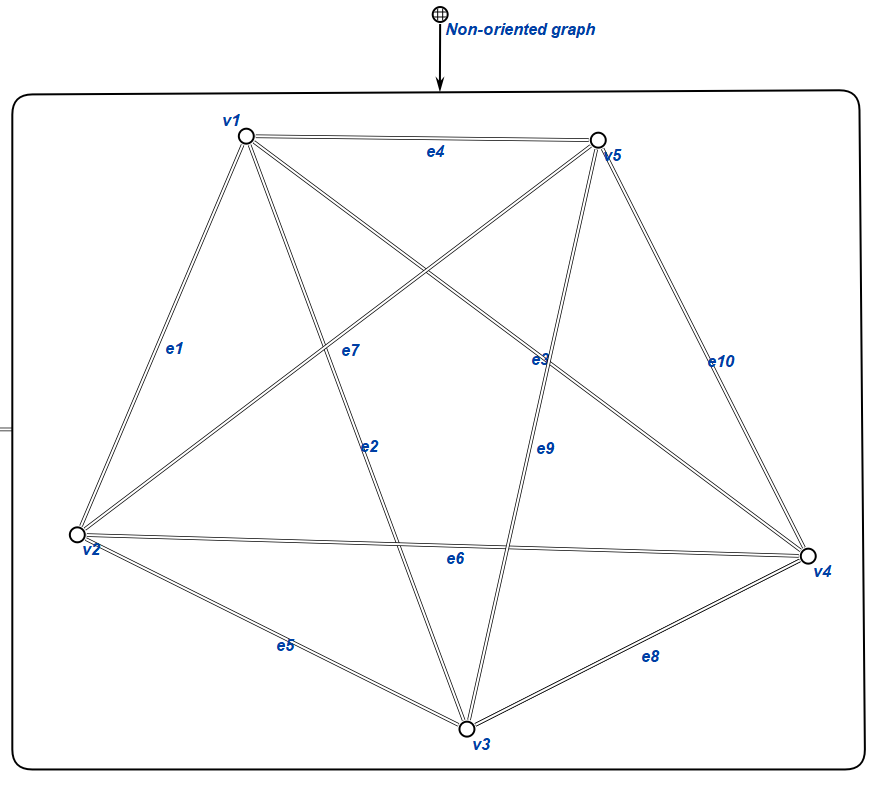

Данный граф состоит из пяти вершин: v1, v2, v3, v4, v5.

И десяти рёбер: e1, e2, e3, e4, e5, e6, e7, e8, e9, e10.

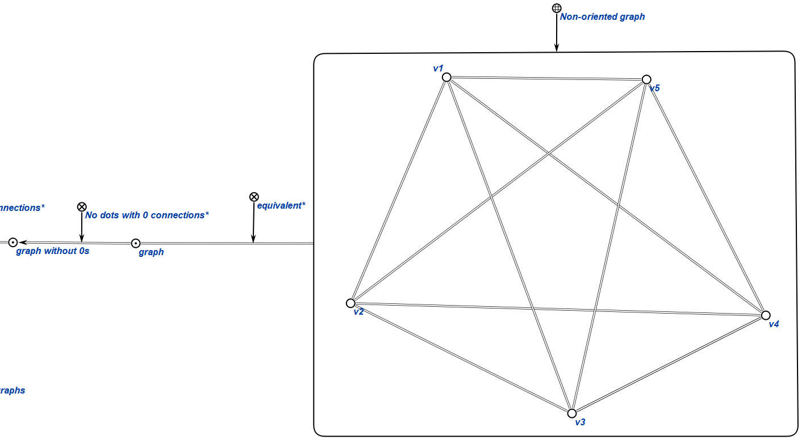

1. Удаляем из графа все вершины, степень которых рана 0.

```
equivalent* - отношение равнозначности понятий

Например, в данном случае конструкция в рамке - это то же самое, что и понятие graph.

No dots with 0 connections* - это отношение, связывающее graph without 0s (в состав которого входят все рёбра, принадлежащие исходному графу и только те врешины, степень которых больше 0) и graph.
```

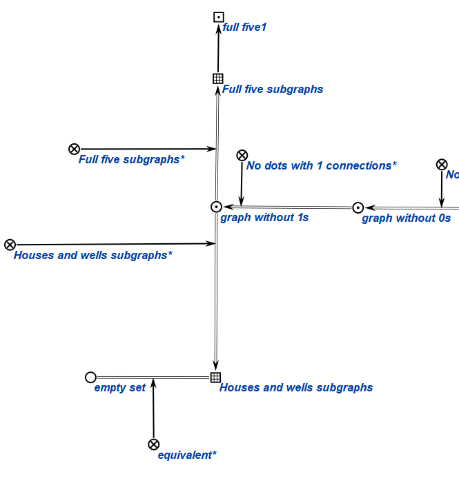

2. Удаляем все вершины со степенью 1 и рёбра, которые с ними связаны.
3. Удаляем все вершины со стпенью 2
4. Рёбра, которые были с ними связаны, заменяем по следующему принципу: 
5. Вершина связана с первой точкой и второй точкой рёбрами 1 и 2 соответственно
6. Удаляем ребро 1
7. Удаляем ребро 2
8. Добавляем ребро, соединяющее точки 1 и 2.

```
No dots with 1 connections* - это отношение, связывающее graph without 1s (Отсутсвуют вершины, степень которых меньше или равна двум; рёбра, которые соединяют 2 вершины со степенью больше чем 2 и вершину со степенью 2 заменяются на новые рёбра, соединяющие две вершины со степенями больше чем 2).

Full five subgraphs - множество подграфов графа graph without 1s, соответствующих следующим условиям: каждый подграф состоит из 5-ти вершин, все эти подграфы полные, все множества вершин подграфов - различные.

Full five subgraphs* - этношение, связывающее graph without 1s и множество подграфов Full five subgraphs.

full five1 - конкретный подграф, принадлежащий множеству Full five subgraphs.

Houses and wells subgraphs - множество всех двудольных подграфов K 3,3, все множества вершин подграфов - различные.

Houses and wells subgraphs* - отношение, связывающее graph witout 1s и Houses and wells.

empty set - пустое иножество

В данном случае Houses and wells subgraphs - это пустое множество.
```

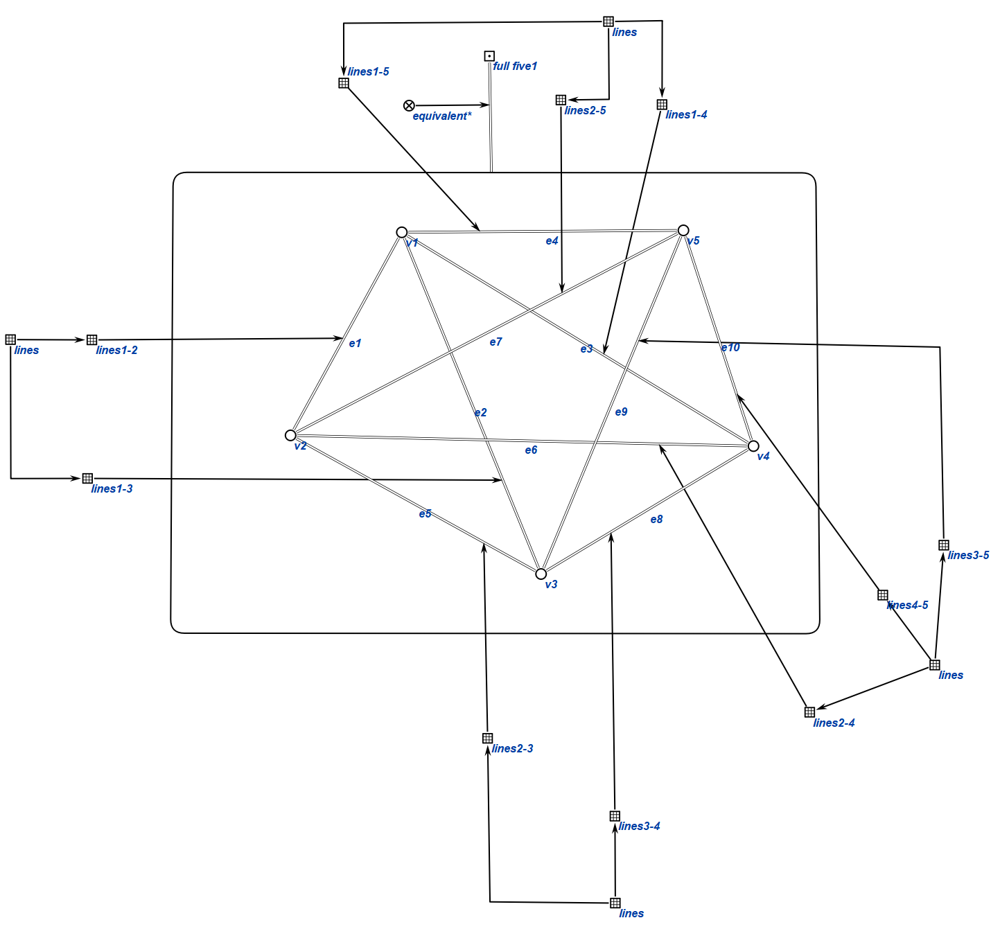

9. Находим все различные множества вершин мощностью 5.

10. Для каждого множества: выбираем все рёбра графа, которые связывают вершины данного множества.

11. Для каждого множества: Если количество рёбер равно 10, то добавляем подграф, состоящий из множества вершин и соответствующего множества рёбер во множество Full five subgraphs.

12. Находим все различные подграфы исходного графа, которые являются полными двудольными графами с 6-ю вершинами.

Теперь рассмотрим множества подграфов Full five subgraphs и Houses and wells subgraphs. 

В данном случае full five 1 - единственный подграф принадлежащий данным множествам. 

```
Множество lines - множ., подмножествами которого являются множества одинаковых рёбер в разных подграфов.

lines1-2 - множество рёбер e1 в различных подграфах.

lines1-3 - множество рёбер e2 в различных подграфах.

lines1-4 - множество рёбер e3 в различных подграфах.

lines1-5 - множество рёбер e4 в различных подграфах.

lines2-3 - множество рёбер e5 в различных подграфах.

lines2-4 - множество рёбер e6 в различных подграфах.

lines2-5 - множество рёбер e7 в различных подграфах.

lines3-4 - множество рёбер e8 в различных подграфах.

lines3-5 - множество рёбер e9 в различных подграфах.

lines4-5 - множество рёбер e10 в различных подграфах.
```

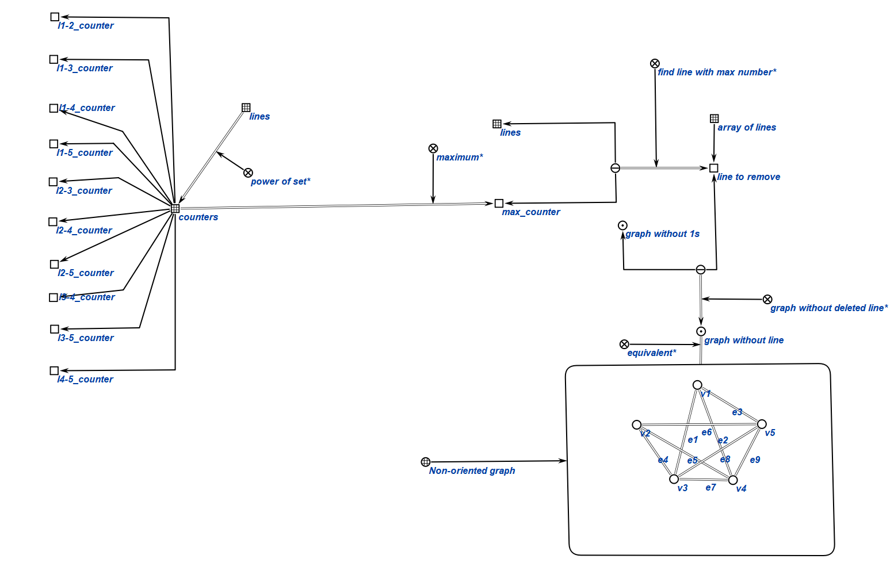

13. Для каждого ребра в подграфах создаём множество. Добавляем в него все соответсвующие рёбра в различных подграфах.

14. Находим мощность каждого мжножества рёбер.

Далее на основании множества lines будем определять рёбро для удаления.

```
counters - множество счётчиков для определения количества вхождений каждого ребра

l1-2_counter - счётчик для ребра e1

l1-3_counter - счётчик для ребра e2

l1-4_counter - счётчик для ребра e3

l1-5_counter - счётчик для ребра e4

l2-3_counter - счётчик для ребра e5

l2-4_counter - счётчик для ребра e6

l2-5_counter - счётчик для ребра e7

l3-4_counter - счётчик для ребра e8

l3-5_counter - счётчик для ребра e9

l4-5_counter - счётчик для ребра e10
```

15. Далее с помощью отношения maximum* находим счётчик с максимальным количеством рёбер. 

16. На основании множества рёбер и счётчика находим ребро для удаления. Оно будет принадлежать множеству array of lines - это множество для записи результата.

17. graph without line - граф с учётом того, что ребро line to remove было удалено.

В рассмотренном примере полученный граф является планарным, поэтому дальнейших действий не требуется.

## Тестовые примеры

На вход подаётся граф, а в результате получается множество рёбер для удаления.

### Тест 1

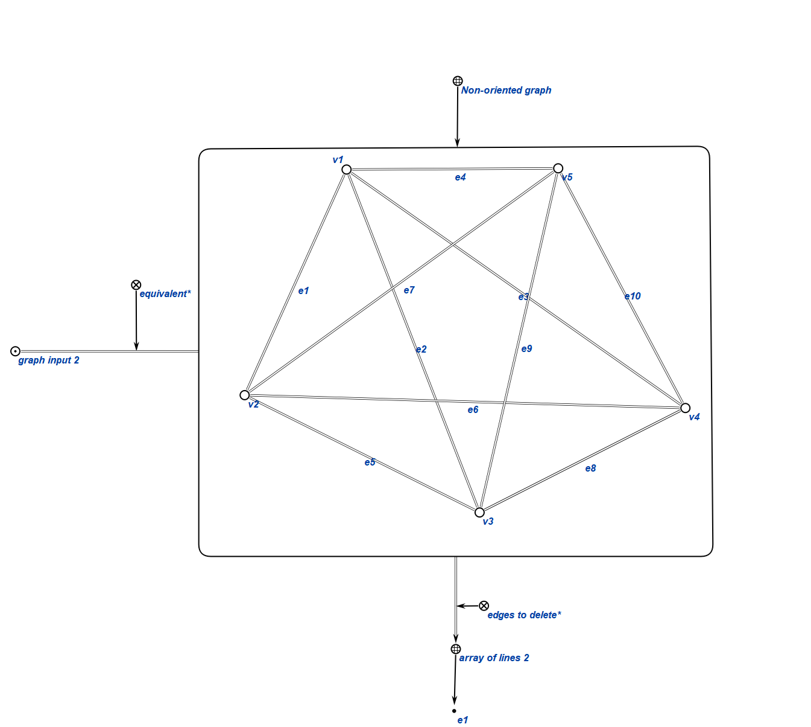

### Тест 2

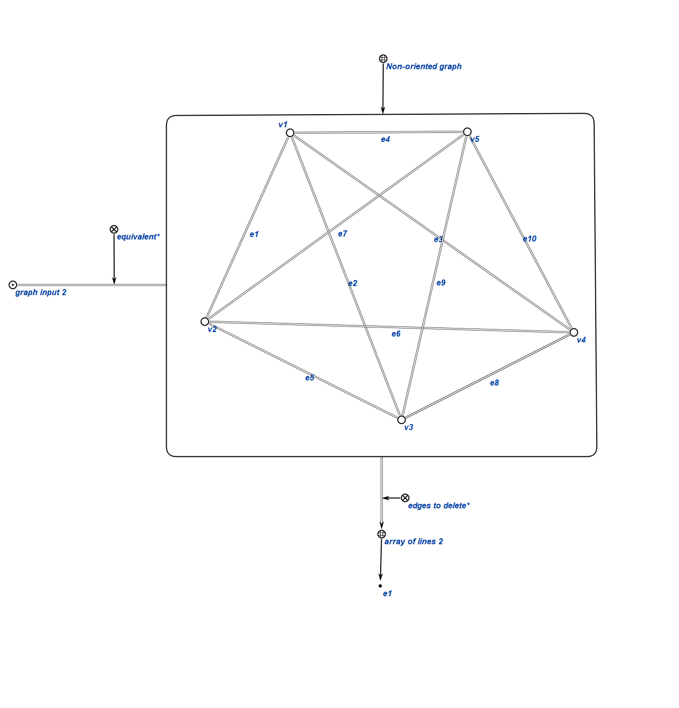

### Тест 3

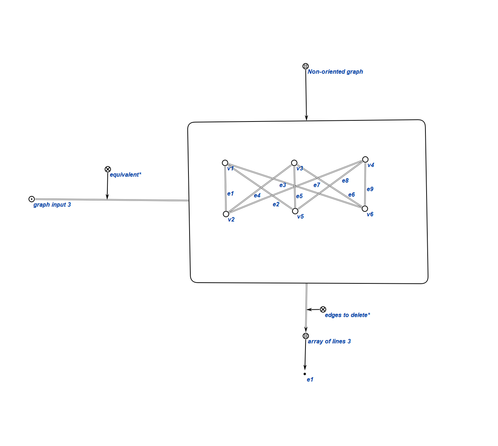

### Тест 4

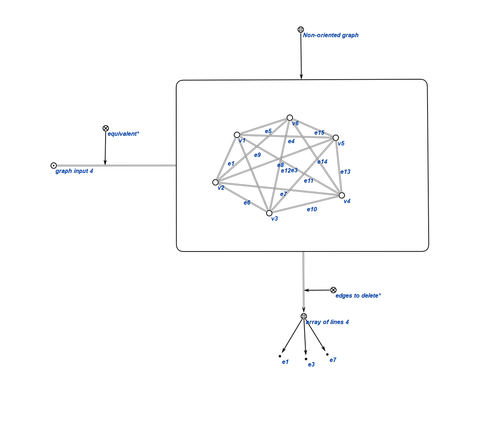

### Тест 5

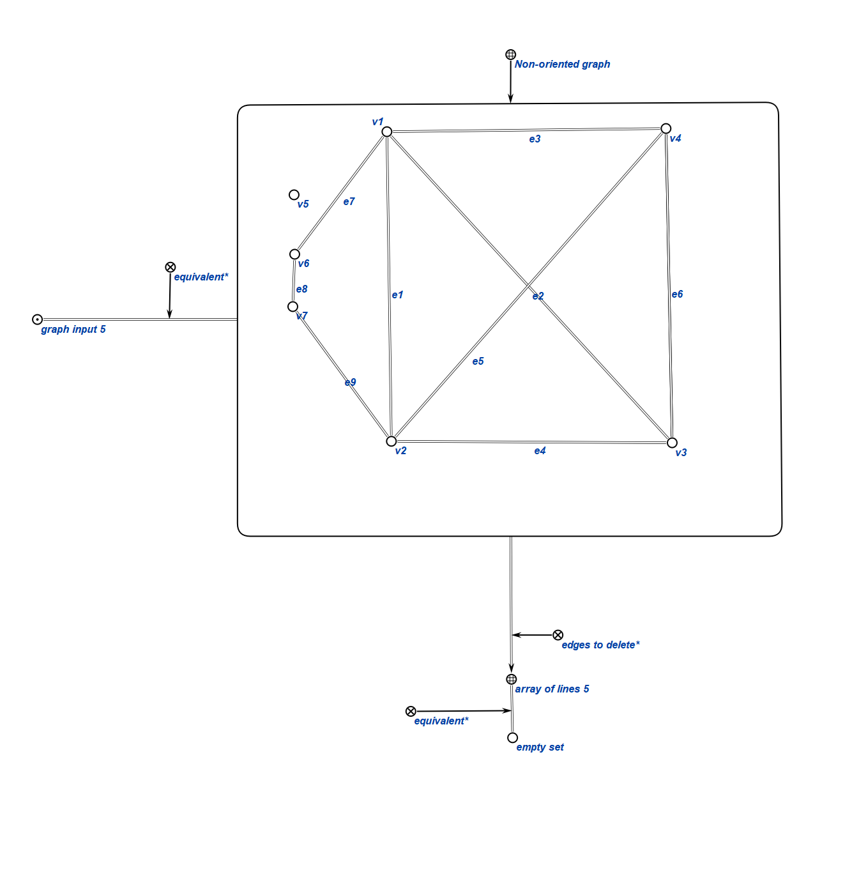

## Добавили gwf-файл с формализацией в ostis-example-app

В web-интерфейсе можно просматривать графическое и текстовое представление основных понятий алгоритма.

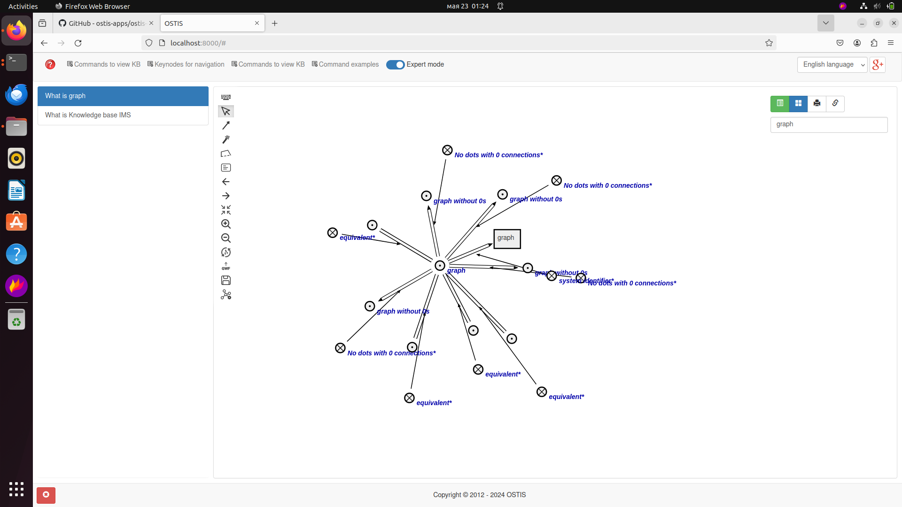

## Итоги

1. Формализовали основные понятия, связанные с расчётной работой.

2. Улучшили навыки работы с scg кодом и редактором баз знаний KBE.

3. Привели примеры использованя алгоритма.

## Источники

1. Руководство к выполнению расчетной работы по курсам ОИИ и ППвИС / Д.А. Лазуркин