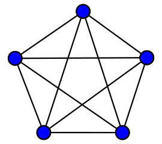
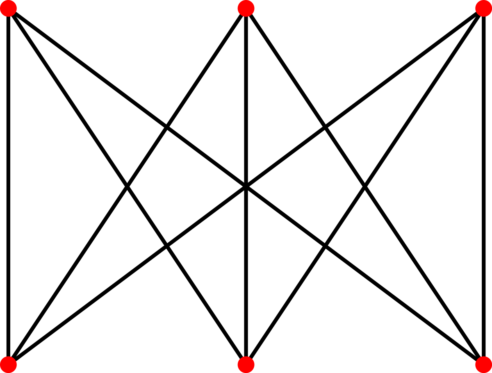

# Рассчётная работа Отчёт
### Самович Вячеслав
### Группа 321 701
### Вариант 6.4
## Задание
Найти минимальное множество рёбер графа, удаление которых позволяет сделать
его планарным


## 1. Представление графов, способы ввода

Для ориентированных, неориентированных и мультиграфов сведём задачу к неориентированному графу по следующему принципу:

Если в графе между вершинами есть хотя бы одна дуга, то заменим её ребром. (в итоге получаем симметричную матрицу смежности)

Обозначим способы ввода графа в программу:

1. Список смежности (listin) - перечисление всех рёбер графа

2. Список отсутствия смежности (listout) - перечисление множества рёбер, отсутствующих в данном графе и при этом присутствующих в полном графе для заданного множества точек (для удобства задания полных или близких к ним графов)

3. Матрица инцидентности (matrixout) - по строкам точки от 1 до m, по столбцам рёбра от 1 до (m-1)!  Если  на пересечении строки и столбца стоит 1, то ребро существует.

## 2. Сущность графа в программе

Посколько при проверке на планарность граф рассматривается на плоскости, термины вершина и ребро можно заменить на точка и линия для упрощения понимания.

Объявим класс граф, включающий в себя поля: 
```c#
public List<Dot> Dots { get; set; }

public List<Line> Lines { get; set; }
``` 
это означает, что граф состоит из множества точек и множества линий

## 3. Способ нахождения минимального множества рёбер, удаление которых позволит сделать граф планарным

Возпользуемся теоремой Понтрягина — Куратовского

1. С помощью гомеоморфных преобразований упростим граф

2. Последовательно делаем планарным подграфы, представляющие из себя полные пятёрки, удаляя из каждого по одному ребру

3. Последовательно делаем планарным подграфы, представляющие из себя домики и колодцы 3,3 , удаляя из каждого по одному ребру

## 4. Упрощение графов с помощью гомеморфных преобразований

Точки, степень которых равна нулю или одному и связанные с ними линиями не будем брать в расчёт, так как они не способны помешать планарности графа.

Если в графе есть точки со степенью 2, то сделаем с ними следующее гомеоморфное преобразование: 

### заменим


### на


## 5. "Ломание" полных пятёрок



Полная пятёрка - не планарный граф. Для того, чтобы сделать его планарным необходимо удалить любое ребро. Однако, чтобы найти оптимльное ребро для удаления необходимо учитывать сколько раз ребро входит в полные пятёрки и домики и колодцы, также предпочтительно удалять рёбра у тех вершин, у котрых ранее было удалено минимальное количество рёбер.

После того, как найден первый подграф, "ломаем" его и снова проверяем весь граф на наличие полных пятёрок. Когда подграфов больше не осталось, переходим к поиску домиков и колодцев.


## 6. "Ломание" домиков и колодцев



Домики и колодцы - не планарный граф. Для того, чтобы сделать его планарным необходимо удалить любое ребро. Однако, чтобы найти оптимльное ребро для удаления необходимо учитывать сколько раз ребро входит в полные пятёрки и домики и колодцы, также предпочтительно удалять рёбра у тех вершин, у котрых ранее было удалено минимальное количество рёбер.

После того, как найден первый подграф, "ломаем" его и снова проверяем весь граф на наличие домиков и колодцев. Когда подграфов больше не осталось, все рёбра найдены.

## Примеры выполнения программы

```
Examples:
full five:
_____________________________________________________________
Graph contains
10 lines:
1 - 2
1 - 3
1 - 4
1 - 5
2 - 3
2 - 4
2 - 5
3 - 4
3 - 5
4 - 5
5 dots with number of connected lines:
1 - 4
2 - 4
3 - 4
4 - 4
5 - 4
_____________________________________________________________
five removed
Removed lines:
1-2


Full six without 1-2:
_____________________________________________________________
Graph contains
14 lines:
1 - 3
1 - 4
1 - 5
2 - 3
2 - 4
2 - 5
3 - 4
3 - 5
4 - 5
1 - 6
2 - 6
3 - 6
4 - 6
5 - 6
6 dots with number of connected lines:
1 - 4
2 - 4
3 - 5
4 - 5
5 - 5
6 - 5
_____________________________________________________________
five removed
three-three removed
Removed lines:
3-4
5-6


K 3,3:
_____________________________________________________________
Graph contains
9 lines:
1 - 4
1 - 5
1 - 6
2 - 4
2 - 5
2 - 6
3 - 4
3 - 5
3 - 6
6 dots with number of connected lines:
1 - 3
2 - 3
3 - 3
4 - 3
5 - 3
6 - 3
_____________________________________________________________
three-three removed
Removed lines:
1-4
```