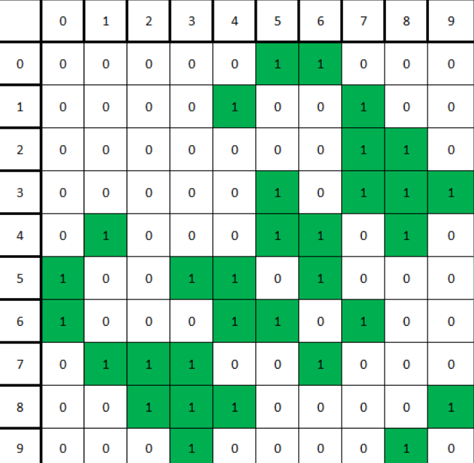
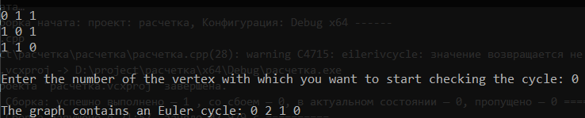
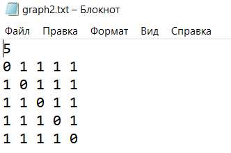
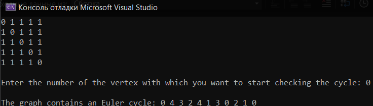
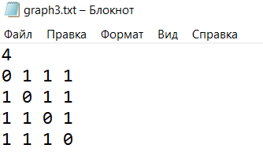

# Расчетная работа

## Введение
---
### Цель
Изучить основы теории графов, способы представления графов, базовые алгоритмы для работы с графами.
### Задание
5.2 Найти эйлеров цикл в графе 

Реализовать на C++ код, который может найти эйлеров цикл в неориентированном графе.

Граф представляется в виде матрицы смежности.

### Ключевые понятия
`Граф` - математическая абстракция реальной системы любой природы, объекты которой обладают парными связями.

`Неориентированный граф` — это тип графа, в котором рёбра (или связи) между вершинами не имеют направления.

`Матрица смежности` - это способ представления графа в виде квадратной матрицы, где строки и столбцы представляют вершины графа, а значения в ячейках показывают наличие или отсутствие ребра между соответствующими вершинами.

`Путь в графе` – это последовательность рёбер, в которой конец каждого ребра (кроме последнего) совпадает с началом следующего.
Замкнутый путь называется `циклом`. 

`Эйлеров цикл` — это путь в графе, который проходит через каждое ребро ровно один раз и возвращается в начальную вершину. Эйлеров цикл существует только в графах, где все вершины имеют четную степень (количество инцидентных рёбер).

`Эйлеров путь` — это путь в графе, который проходит через каждое ребро ровно один раз. Однако, в отличие от Эйлерова цикла, Эйлеров путь не обязательно начинается и заканчивается в одной и той же вершине.

`Поиск в глубину ` — это один из базовых алгоритмов обхода или поиска в графах. Он начинает с одной вершины и идет по всем ее смежным вершинам вглубь, до тех пор, пока не достигнет конечной вершины или не посетит все вершины в графе.

Графический пример поиска в глубину:


## Алгоритм решения

1.Проверяем основыные требования к эйлеровому графу: связность и четные степени всех вершин. Если условия не выполняются, то и смысла продолжнать программу нет, а значит в таком случае можем ее досрочно завершить.

2.Запускаем поиск в глубину, который учитывает пройденные вершины, помечая их в отдельном списке, и наличие связей, сравнивая значения в матрице смежности. DFS проходит по всем вершинам, а если выхода из вершины нет, то он делает шаг назад и перемещает вершину, из которой выхода нет, в эйлеров цикл. В результате мы получаем список, в котором находится эйлеров цикл.

Если эйлеров цикл обнаружен, мы выводим его на экран. В противном случае выводим сообщение "net cycla".

_Приведем пример выполнения алгоритма:_

Исходный граф:


Исходная матрица смежности:


Для наглядности будем использовать 2 списка: visited и euler. Общий принцин работы: заходим в вершину и помечаем ее как посещенную, ищем ближайшую непосещенную вершину, которая связана с нашей, и переходим в нее. Если выхода из вершины нет, то переносим вершину в список euler и делаем шаг назад, при это не восстанавливая связь.

1. Начинаем с вершины 0:

visited = [0]

euler = []

Ближайшая непосещенная вершина - 5

2. Заходим в вершину 5:

visited = [0,5]

euler = []

Ближайшая непосещенная вершина - 3


3. Заходим в вершину 3:

visited = [0,5,3]

euler = []

Ближайшая непосещенная вершина - 7


4. Заходим в вершину 7:

visited = [0,5,3,7]

euler = []

Ближайшая непосещенная вершина - 1


5. Заходим в вершину 1:

visited = [0,5,3,7,1]

euler = []

Ближайшая непосещенная вершина - 4


6. Заходим в вершину 4:

visited = [0,5,3,7,1,4]

euler = []

Ближайшая непосещенная вершина - 5


7. Заходим в вершину 5:

visited = [0,5,3,7,1,4,5]

euler = []

Ближайшая непосещенная вершина - 6


8. Заходим в вершину 6:

visited = [0,5,3,7,1,4,5,6]

euler = []

Ближайшая непосещенная вершина - 0


9. Заходим в вершину 0:

visited = [0,5,3,7,1,4,5,6,0]

euler = []

Как видно из матрицы смежности, выхода из вершины нет, а значит переносим вершину и делаем шаг назад.


10. Вернулись к 6:

visited = [0,5,3,7,1,4,5,6]

euler = [0]

Ближайшая непосещенная вершина - 4


11. Заходим в вершину 4:

visited = [0,5,3,7,1,4,5,6,4]

euler = [0]

Ближайшая непосещенная вершина - 8


12. Заходим в вершину 8:

visited = [0,5,3,7,1,4,5,6,4,8]

euler = [0]

Ближайшая непосещенная вершина - 2


13. Заходим в вершину 2:

visited = [0,5,3,7,1,4,5,6,4,8,2]

euler = [0]

Ближайшая непосещенная вершина - 7

14. Заходим в вершину 7:

visited = [0,5,3,7,1,4,5,6,4,8,2,7]

euler = [0]

Ближайшая непосещенная вершина - 6


15. Заходим в вершину 6:

visited = [0,5,3,7,1,4,5,6,4,8,2,7,6]

euler = [0]

Как видно, выходна снова нет, повторяем операции до тех пор, пока не найдем выход.


16. Вернулись в вершину 8:

visited = [0,5,3,7,1,4,5,6,4,8]

euler = [0,6,7,2]

Ближайшая непосещенная вершина - 3


17. Заходим в вершину 3:

visited = [0,5,3,7,1,4,5,6,4,8,3]

euler = [0,6,7,2]

Ближайшая непосещенная вершина - 9


18. Заходим в вершину 9:

visited = [0,5,3,7,1,4,5,6,4,8,3,9]

euler = [0,6,7,2]

Ближайшая непосещенная вершина - 8


19. Заходим в вершину 8:

visited = [0,5,3,7,1,4,5,6,4,8,3,9,8]

euler = [0,6,7,2]

Как видно, выходов нет и все вершины мы прошли, поэтому просто переносим по порядку все вершины из visited в euler




20. Переносим вершины.

visited = []

euler = [0,6,7,2,8,9,3,8,4,6,5,4,1,7,3,5,0]

Эйлеров цикл получен.
 
## Реализация на C++

Код, выполняющий наш алгоритм:

```c++
#include <iostream>
#include <vector>
#include <fstream>


using namespace std;

 bool eilerivcycle(int v, vector<int>& visited, vector<int>& euler, vector<vector<int>>& matrix) {
        visited.push_back(v);
        for (int i = 0; i < matrix.size(); ++i) {
            if (matrix[v][i] == 1 && i != visited[visited.size() - 1]) {
                matrix[v][i] = 0;
                matrix[i][v] = 0;
                eilerivcycle(i, visited, euler, matrix);
            }
        }
        if (visited.empty()) {
            return 1;
        }
        euler.push_back(v);
        visited.pop_back();
        if (visited.empty()) {
            return 1;
        }
        v = visited[visited.size() - 1];
        visited.pop_back();
        eilerivcycle(v, visited, euler, matrix);
    }
    bool is_cicle( int startVetrex, vector<int>& visited, vector<int>& euler, vector<vector<int>>& matrix)
    {

        for (int i = 0; i < matrix.size(); i++)
        {
            int k = 0;
            for (int j = 0; j < matrix.size(); j++)
            {
                k = k + matrix[i][j];
            }
            if (k % 2 != 0 || k==0) {
                return 0;
            }
        }
        return eilerivcycle(startVetrex, visited, euler, matrix);
    }
    void print(vector<vector<int>>& matrix,int& vertex  )
    { 
        for (int i = 0; i < vertex; i++)
        {
            for (int j = 0; j < vertex; j++)
                cout << matrix[i][j] << ' ';
            cout << '\n';
        }
    }
 

int main() {
    vector<vector<int>> matrix;
    ifstream  in("graph2.txt");
    int rows1;
    in >> rows1;

    for (int i = 0; i < rows1; i++)
    {
        vector<int> row(rows1);
        for (int j = 0; j < rows1; j++)
        {
            in >> row[j];
        }
        matrix.push_back(row);
    }

    in.close();
    print(matrix,rows1);
    cout << endl << "Enter the number of the vertex with which you want to start checking the cycle: ";
    int startVertex;
    cin >> startVertex;
    cout << endl;

    vector<int> visited;
    vector<int> euler;

    if (is_cicle(startVertex, visited, euler, matrix)) {
        cout << "The graph contains an Euler cycle: ";
        for (int i = 0; i < euler.size(); i++) {
            cout << euler[i] << " ";
        }

    }
    else cout << "net cycla";
}
```

## Тестирование

Результаты выполнения программы для 3 случаев: 2 эйлерова графа и 1 обычный граф. 

1) Эйлеров граф на 3 вершины введенный из файла:



   
2) Эйлеров граф на 5 вершин введенный из файла:




3)Пример не существования эйлерова цикла:




## Вывод
 
В результате выполнения расчётной работы приобрёл следующие навыки:
- изучил основы теории графов
- изучил способы представления графов
- изучил базовые алгоритмы для работы с графами
- изучил базовые алгоритмы работы с векторами, очерядими и файлами в C++

